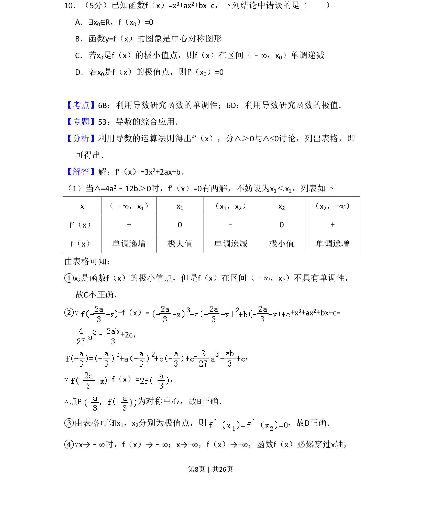
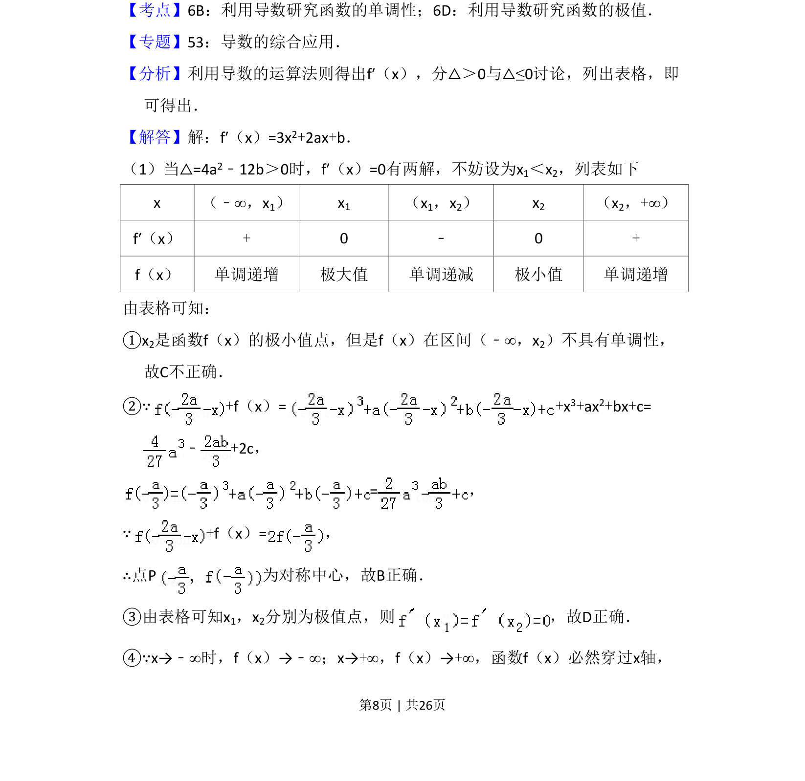
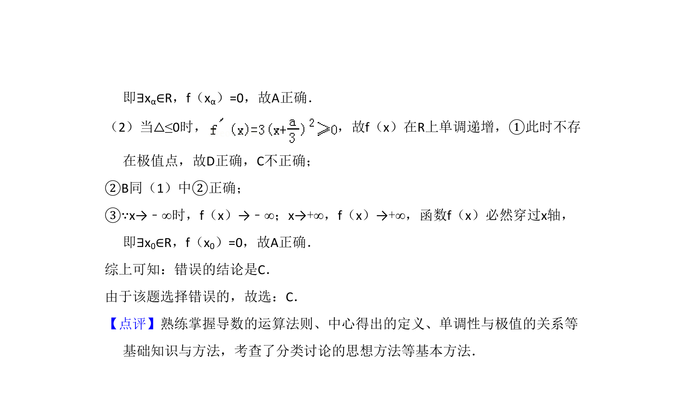

## 题面

## 摘要

该题以三次函数为载体，考查极值点的性质、单调性及函数图像的对称性等综合知识。

## 关联考点

- [[692-函数的极值点|函数的极值点]]
- [[432-导数与函数单调性|导数与函数的单调性]]
- [[602-三次函数的对称性|三次函数的对称性]]

## 答案与解析

> 📄 原 PDF 第 8 页：`素材/真题/吉林/2008-2024·（吉林）数学高考真题/2013年高考数学试卷（理）（新课标Ⅱ）（解析卷）.pdf`

<!-- 题干文本-start -->
## 题干文本
10．（5分）已知函数f（x）=x3+ax2+bx+c，下列结论中错误的是（　　）
A．∃x0∈R，f（x0）=0
B．函数y=f（x）的图象是中心对称图形
C．若x0是f（x）的极小值点，则f（x）在区间（﹣∞，x0）单调递减
D．若x0是f（x）的极值点，则f′（x0）=0
<!-- 题干文本-end -->

<!-- 解析文本-start -->
## 解析文本
【考点】6B：利用导数研究函数的单调性；6D：利用导数研究函数的极值．菁优网版权所有
【专题】53：导数的综合应用．
【分析】利用导数的运算法则得出f′（x），分△＞0与△≤0讨论，列出表格，即
可得出．
【解答】解：f′（x）=3x2+2ax+b．
（1）当△=4a2﹣12b＞0时，f′（x）=0有两解，不妨设为x1＜x2，列表如下 
x （﹣∞，x1） x1 （x1，x2） x2 （x2，+∞）
f′（x） + 0 ﹣ 0 +
f（x） 单调递增 极大值 单调递减 极小值 单调递增
由表格可知：
①x2是函数f（x）的极小值点，但是f（x）在区间（﹣∞，x2）不具有单调性，
故C不正确．
②∵+f（x）=+x 3+ax2+bx+c=
﹣+2c，
=，
∵+f（x）=，
∴点P为对称中心，故B正确．
③由表格可知x1，x2分别为极值点，则 ，故D正确．
④∵x→﹣∞时，f（x）→﹣∞；x→+∞，f（x）→+∞，函数f（x）必然穿过x轴，
<!-- 解析文本-end -->
