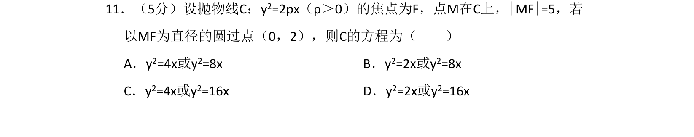
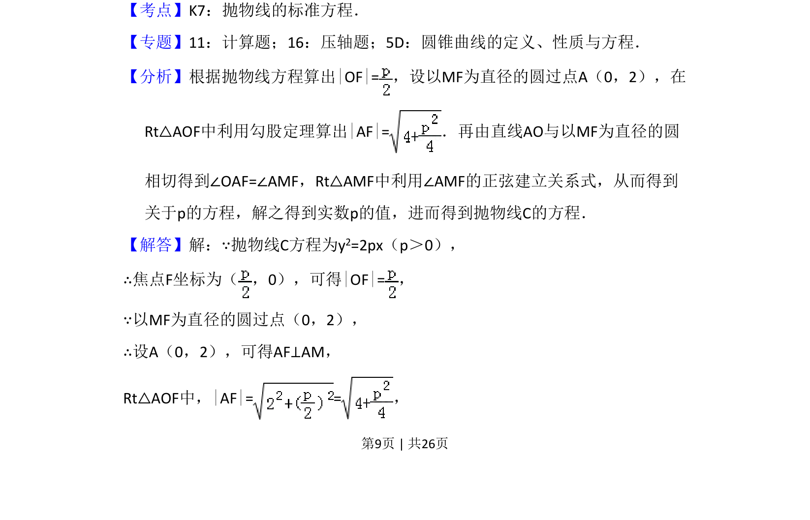
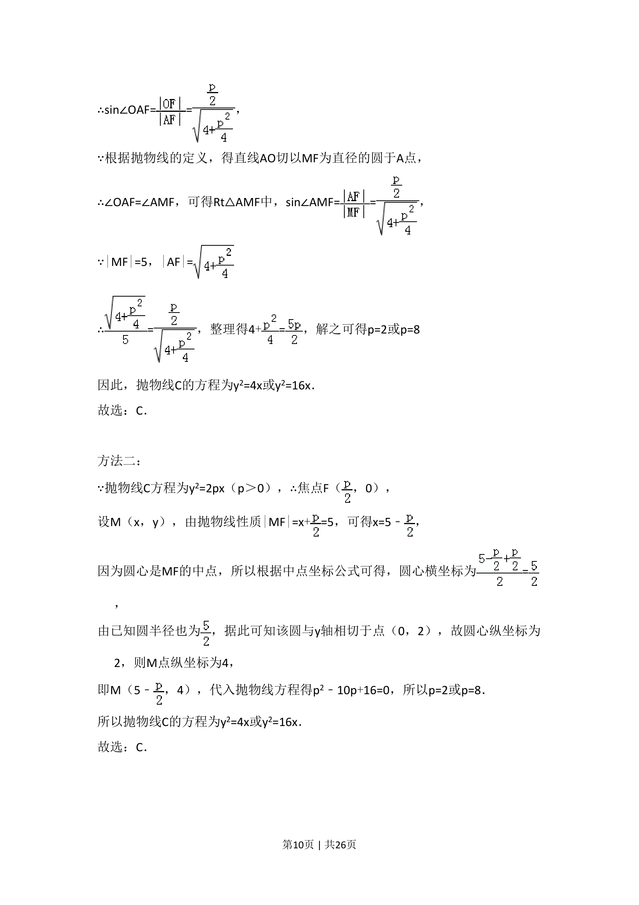
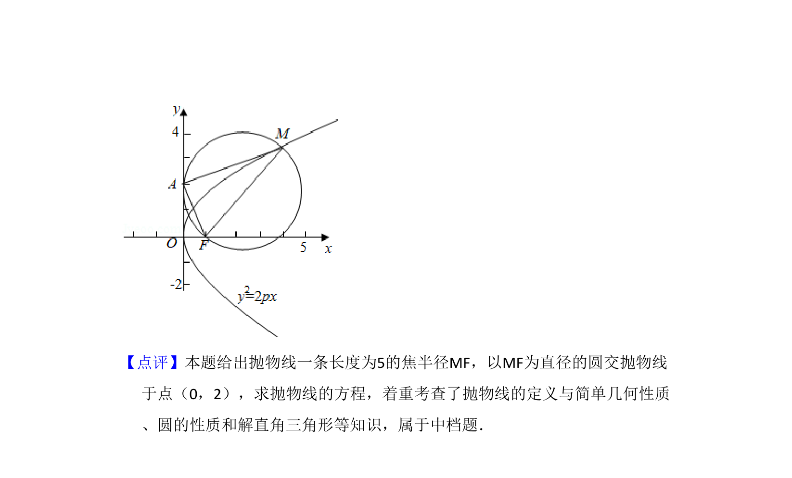

## 题面

## 摘要

已知抛物线焦点弦及圆的性质，求抛物线方程

## 关联考点

- [[880-抛物线的标准方程|抛物线的标准方程]]
- [[1168-焦半径|焦半径]]
- [[777-圆的几何性质|圆的几何性质]]

## 答案与解析

> 📄 原 PDF 第 9 页：`素材/真题/吉林/2008-2024·（吉林）数学高考真题/2013年高考数学试卷（理）（新课标Ⅱ）（解析卷）.pdf`
