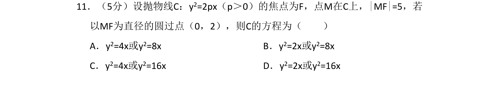
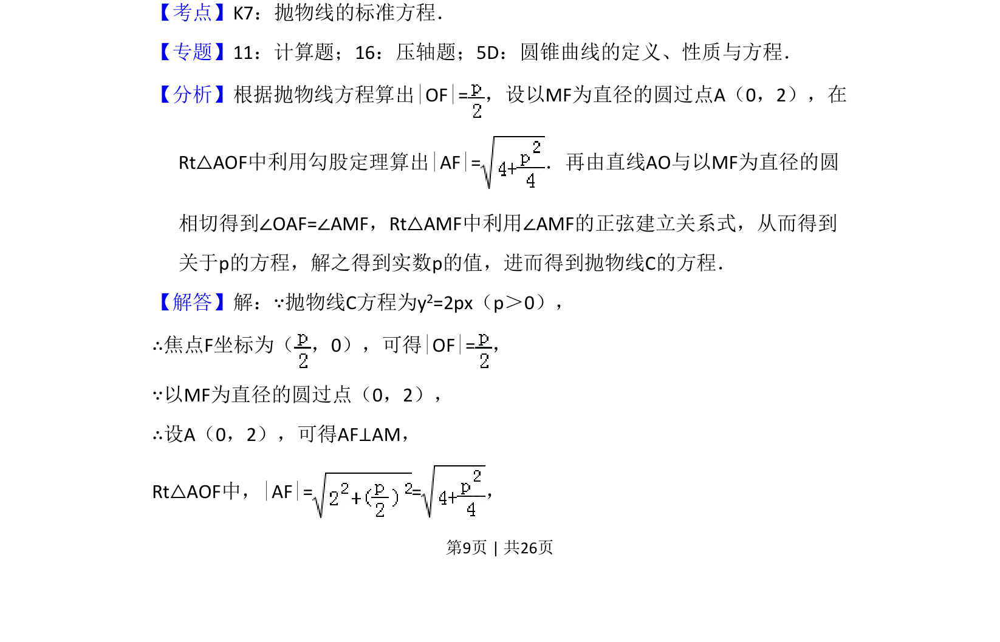
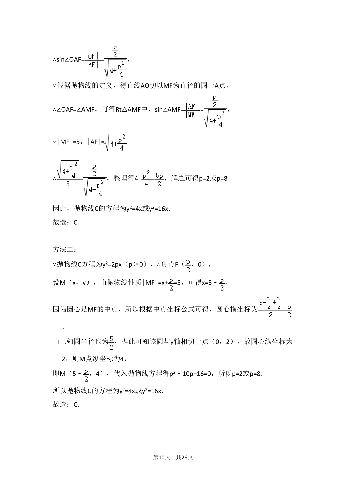
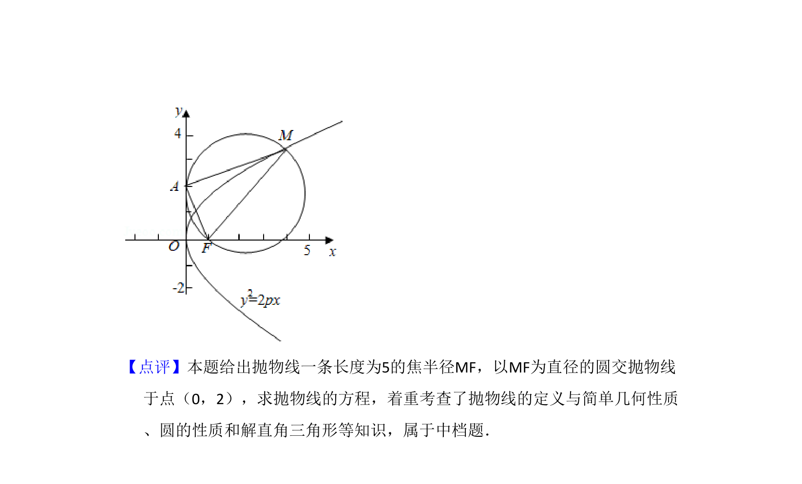

## 题面

## 摘要

已知抛物线焦点弦及圆的性质，求抛物线方程

## 关联考点

- [[1166-抛物线标准方程|抛物线的标准方程]]
- [[1168-焦半径|焦半径]]
- [[777-圆的几何性质|圆的几何性质]]

## 答案与解析

> 📄 原 PDF 第 9 页：`素材/真题/吉林/2008-2024·（吉林）数学高考真题/2013年高考数学试卷（理）（新课标Ⅱ）（解析卷）.pdf`

<!-- 题干文本-start -->
## 题干文本
11．（5分）设抛物线C：y2=2px（p＞0）的焦点为F，点M在C上，|MF|=5，若
以MF为直径的圆过点（0，2），则C的方程为（　　）
A．y2=4x或y2=8x B．y 2=2x或y2=8x
C．y2=4x或y2=16x D．y 2=2x或y2=16x
<!-- 题干文本-end -->

<!-- 解析文本-start -->
## 解析文本
【考点】K7：抛物线的标准方程．菁优网版权所有
【专题】11：计算题；16：压轴题；5D：圆锥曲线的定义、性质与方程．
【分析】根据抛物线方程算出|OF|=，设以MF为直径的圆过点A（0，2），在
Rt△AOF中利用勾股定理算出|AF|=．再由直线AO与以MF为直径的圆
相切得到∠OAF=∠AMF，Rt△AMF中利用∠AMF的正弦建立关系式，从而得到
关于p的方程，解之得到实数p的值，进而得到抛物线C的方程．
【解答】解：∵抛物线C方程为y2=2px（p＞0），
∴焦点F坐标为（ ，0），可得|OF|=，
∵以MF为直径的圆过点（0，2），
∴设A（0，2），可得AF⊥AM，
Rt△AOF中，|AF|= =，
<!-- 解析文本-end -->
