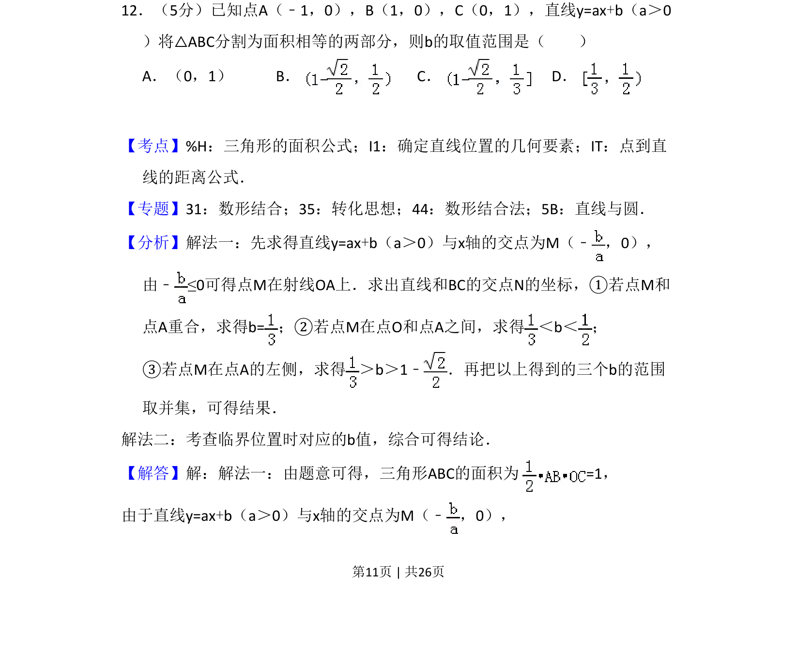
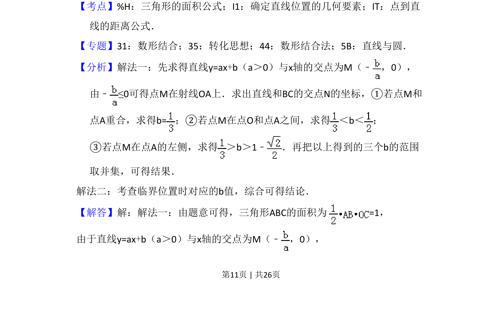
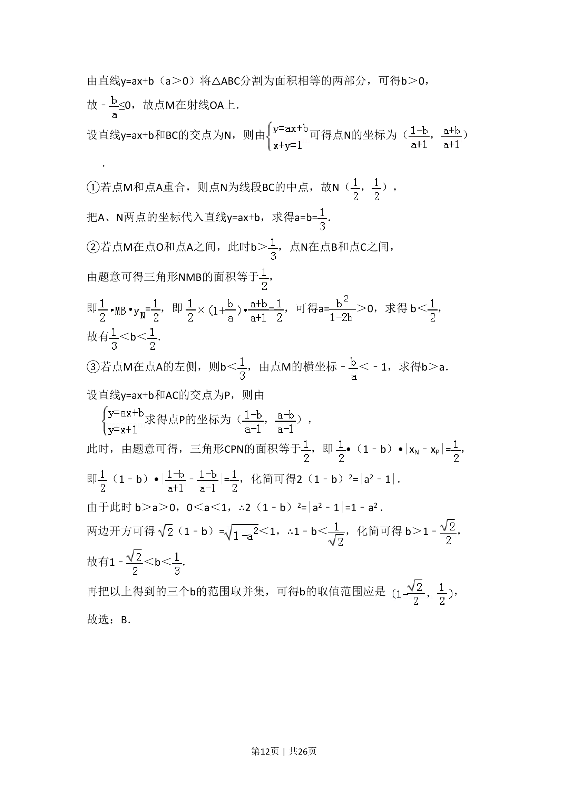
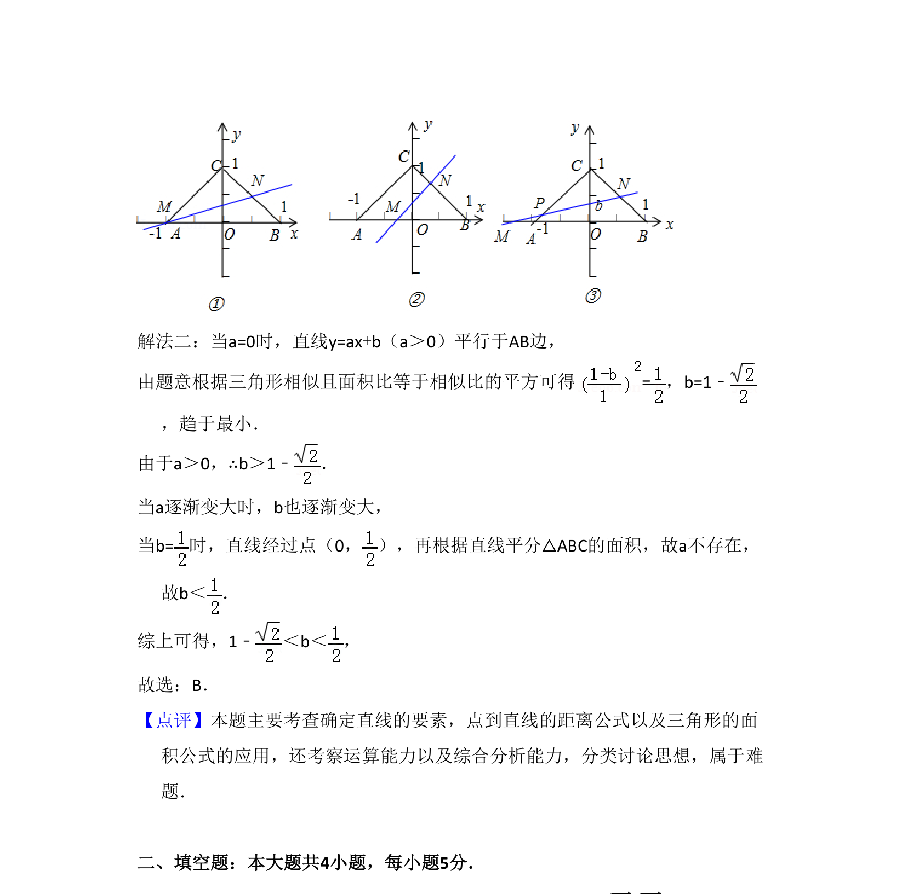

## 题面

## 摘要

考查含参数直线分割三角形为面积相等的两部分，求参数b的取值范围。

## 关联考点

- [[618-三角形的面积公式|三角形的面积公式]]
- [[1220-确定直线位置的几何要素|确定直线位置的几何要素]]
- [[570-点到直线的距离公式|点到直线的距离公式]]

## 答案与解析

> 📄 原 PDF 第 11 页：`素材/真题/吉林/2008-2024·（吉林）数学高考真题/2013年高考数学试卷（理）（新课标Ⅱ）（解析卷）.pdf`
