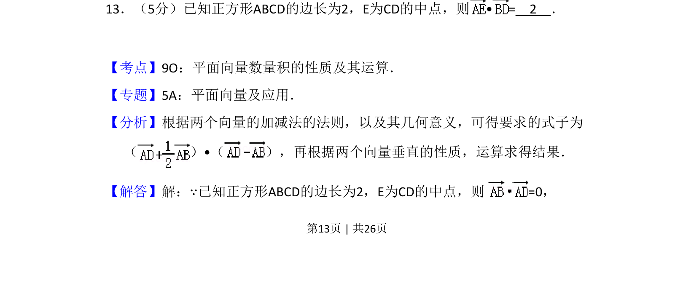
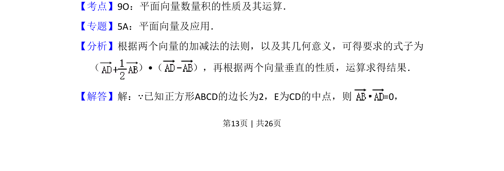
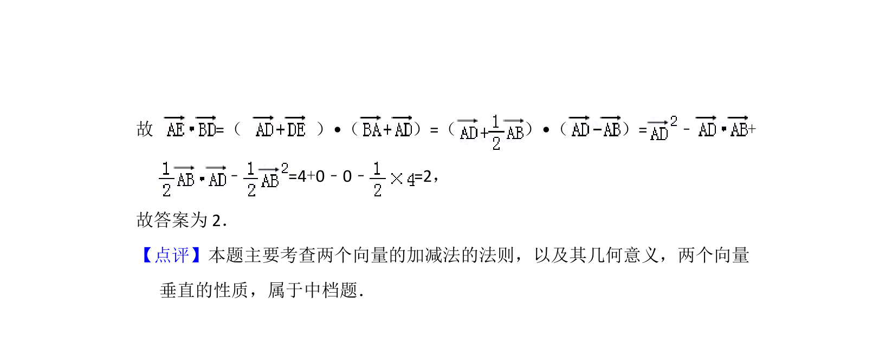

## 题面

## 摘要

在正方形中利用向量垂直性质及加减法计算数量积的值。

## 关联考点

- [[854-平面向量数量积|平面向量数量积]]
- [[542-向量垂直|向量垂直]]
- [[744-向量加减法|向量加减法]]

## 答案与解析

> 📄 原 PDF 第 13 页：`素材/真题/吉林/2008-2024·（吉林）数学高考真题/2013年高考数学试卷（理）（新课标Ⅱ）（解析卷）.pdf`
