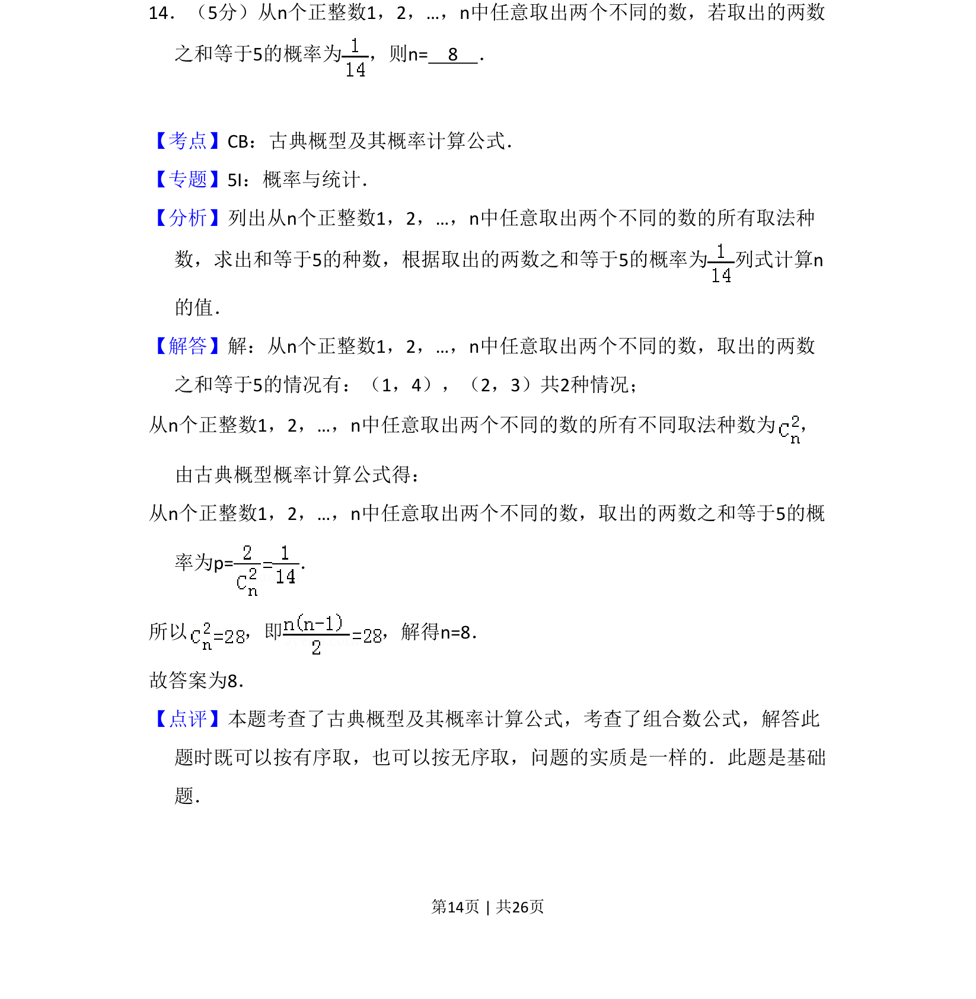
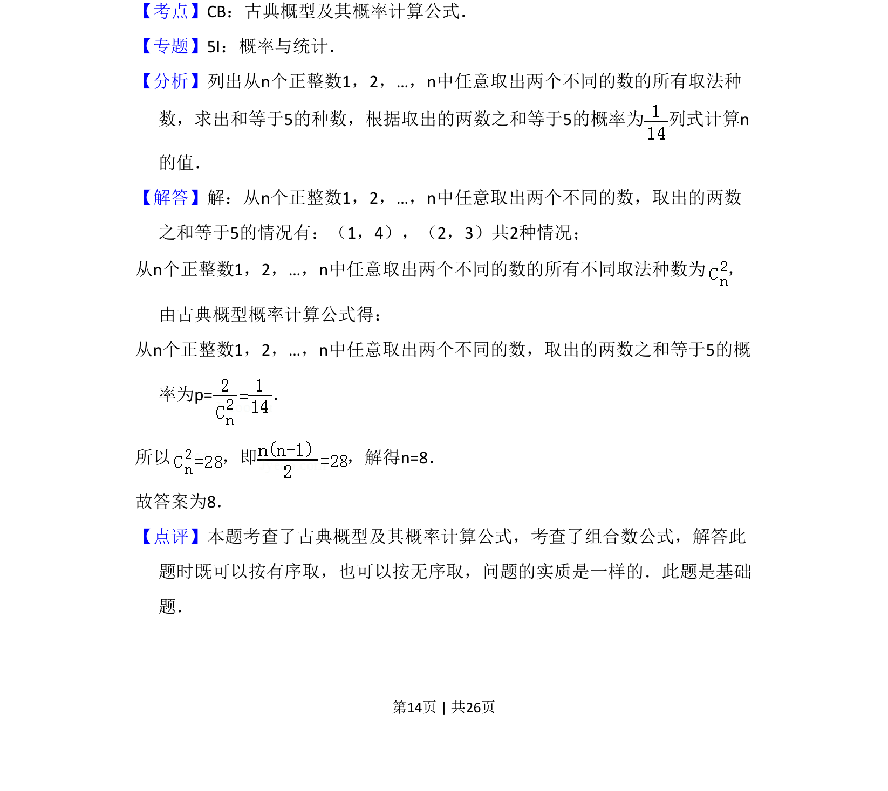

## 题面

## 摘要

从n个正整数中取两数之和为5的概率求n，涉及组合计数与古典概型。

## 关联考点

- [[320-古典概型|古典概型]]
- [[504-组合数公式|组合数公式]]
- [[949-概率计算|概率计算]]

## 答案与解析

> 📄 原 PDF 第 14 页：`素材/真题/吉林/2008-2024·（吉林）数学高考真题/2013年高考数学试卷（理）（新课标Ⅱ）（解析卷）.pdf`
