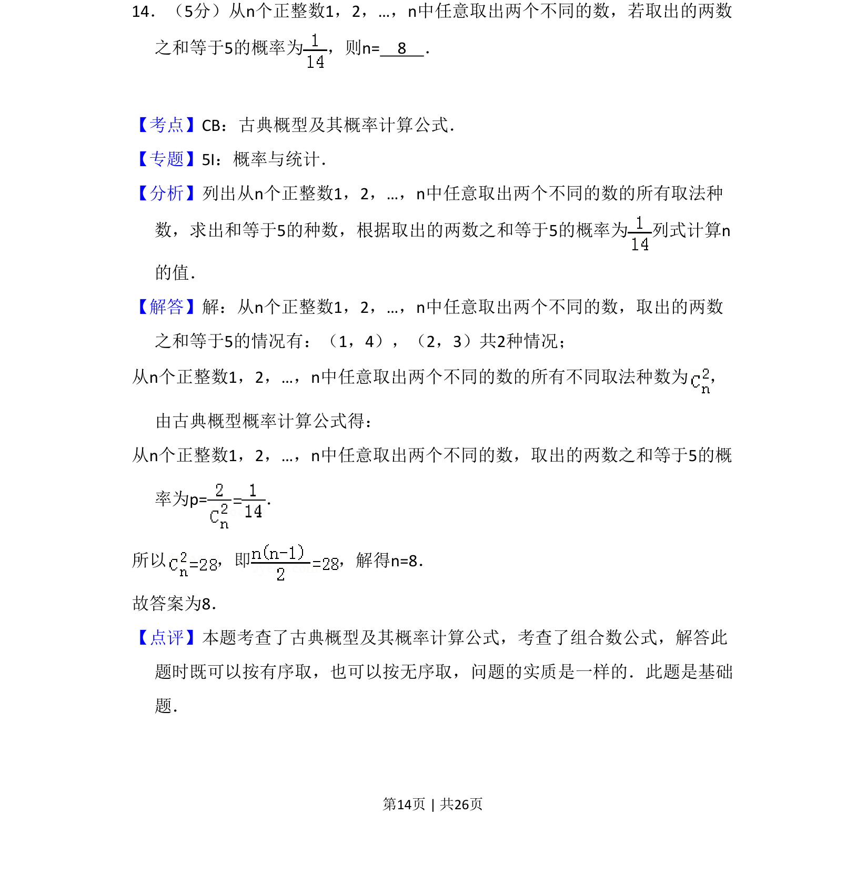
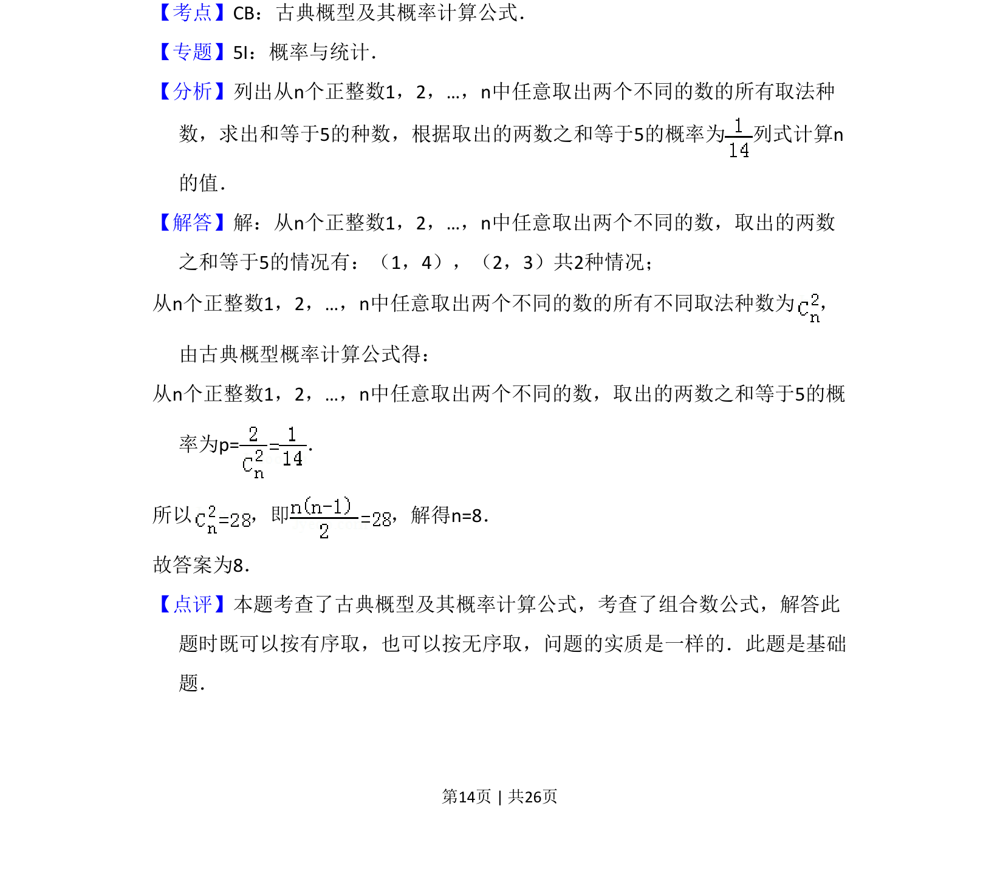

## 题面

## 摘要

从n个正整数中取两数之和为5的概率求n，涉及组合计数与古典概型。

## 关联考点

- [[320-古典概型|古典概型]]
- [[504-组合数公式|组合数公式]]
- [[948-概率计算|概率计算]]

## 答案与解析

> 📄 原 PDF 第 14 页：`素材/真题/吉林/2008-2024·（吉林）数学高考真题/2013年高考数学试卷（理）（新课标Ⅱ）（解析卷）.pdf`

<!-- 题干文本-start -->
## 题干文本
14．（5分）从n个正整数1，2，…，n中任意取出两个不同的数，若取出的两数
之和等于5的概率为 ，则n=　8　．
<!-- 题干文本-end -->

<!-- 解析文本-start -->
## 解析文本
【考点】CB：古典概型及其概率计算公式．菁优网版权所有
【专题】5I：概率与统计．
【分析】列出从n个正整数1，2，…，n中任意取出两个不同的数的所有取法种
数，求出和等于5的种数，根据取出的两数之和等于5的概率为 列式计算n
的值．
【解答】解：从n个正整数1，2，…，n中任意取出两个不同的数，取出的两数
之和等于5的情况有：（1，4），（2，3）共2种情况；
从n个正整数1，2，…，n中任意取出两个不同的数的所有不同取法种数为 ，
由古典概型概率计算公式得：
从n个正整数1，2，…，n中任意取出两个不同的数，取出的两数之和等于5的概
率为p=．
所以 ，即 ，解得n=8．
故答案为8．
【点评】本题考查了古典概型及其概率计算公式，考查了组合数公式，解答此
题时既可以按有序取，也可以按无序取，问题的实质是一样的．此题是基础
题．
<!-- 解析文本-end -->
