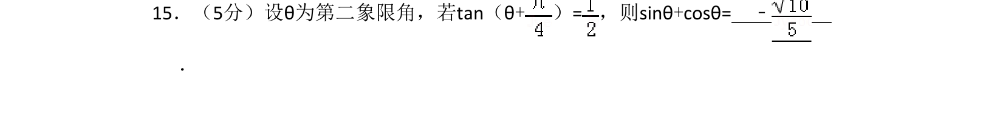
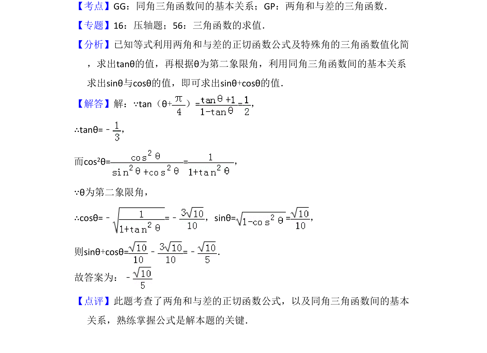

## 题面

## 摘要

已知第二象限角的正切值，利用两角和正切公式及同角关系求正弦与余弦之和

## 关联考点

- [[两角和与差的正切函数]]
- [[同角三角函数基本关系]]
- [[三角函数值的符号]]

## 答案与解析

> 📄 原 PDF 第 15 页：`素材/真题/吉林/2008-2024·（吉林）数学高考真题/2013年高考数学试卷（理）（新课标Ⅱ）（解析卷）.pdf`
