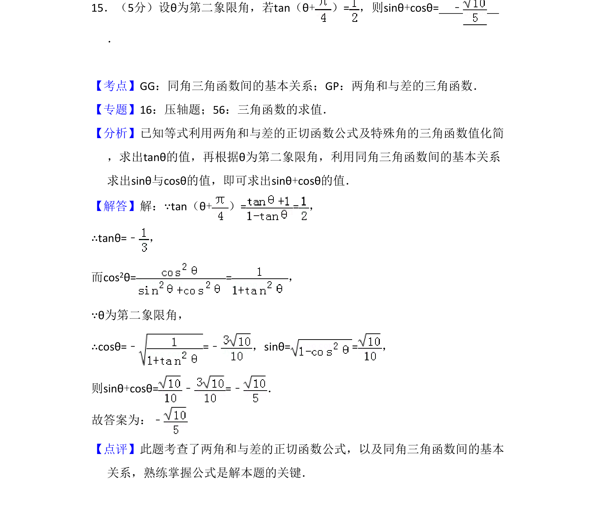
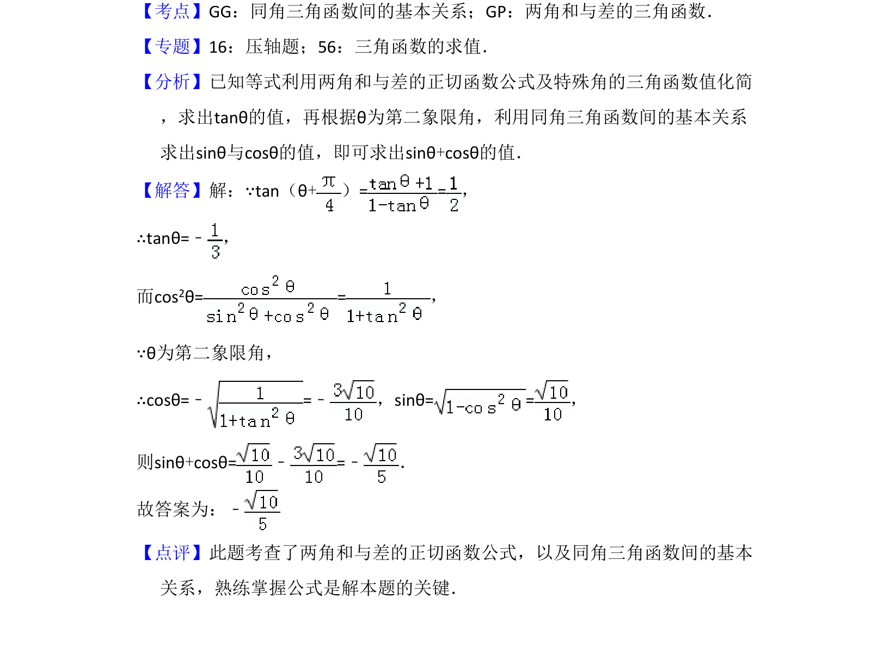

## 题面

## 摘要

已知第二象限角的正切值，利用两角和正切公式及同角关系求正弦与余弦之和

## 关联考点

- [[630-两角和与差的正切函数|两角和与差的正切函数]]
- [[741-同角三角函数基本关系|同角三角函数基本关系]]
- [[527-三角函数值的符号|三角函数值的符号]]

## 答案与解析

> 📄 原 PDF 第 15 页：`素材/真题/吉林/2008-2024·（吉林）数学高考真题/2013年高考数学试卷（理）（新课标Ⅱ）（解析卷）.pdf`

<!-- 题干文本-start -->
## 题干文本
15．（5分）设θ为第二象限角，若tan（θ+）=，则sinθ+cosθ=　﹣ 　
．
<!-- 题干文本-end -->

<!-- 解析文本-start -->
## 解析文本
【考点】GG：同角三角函数间的基本关系；GP：两角和与差的三角函数．菁优网版权所有
【专题】16：压轴题；56：三角函数的求值．
【分析】已知等式利用两角和与差的正切函数公式及特殊角的三角函数值化简
，求出tanθ的值，再根据θ为第二象限角，利用同角三角函数间的基本关系
求出sinθ与cosθ的值，即可求出sinθ+cosθ的值．
【解答】解：∵tan（θ+）= =，
∴tanθ=﹣ ，
而cos2θ==，
∵θ为第二象限角，
∴cosθ=﹣=﹣ ，sinθ==，
则sinθ+cosθ=﹣=﹣ ．
故答案为：﹣
【点评】此题考查了两角和与差的正切函数公式，以及同角三角函数间的基本
关系，熟练掌握公式是解本题的关键．
<!-- 解析文本-end -->
