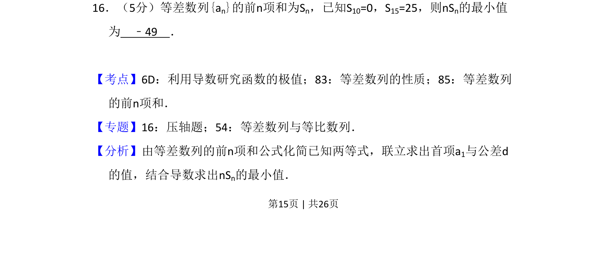
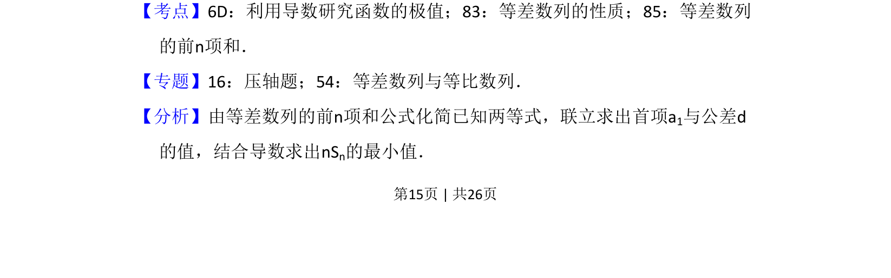
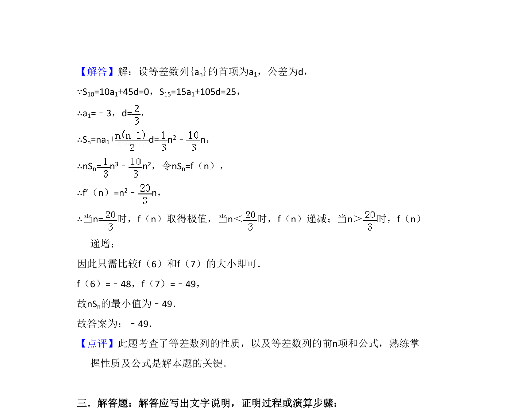

## 题面

## 摘要

由等差数列前n项和条件求首项和公差，利用导数求nSn的最小值

## 关联考点

- [[1061-等差数列的性质|等差数列的性质]]
- [[1060-等差数列的前n项和|等差数列的前n项和]]
- [[707-利用导数研究函数的极值|利用导数研究函数的极值]]

## 答案与解析

> 📄 原 PDF 第 15 页：`素材/真题/吉林/2008-2024·（吉林）数学高考真题/2013年高考数学试卷（理）（新课标Ⅱ）（解析卷）.pdf`
