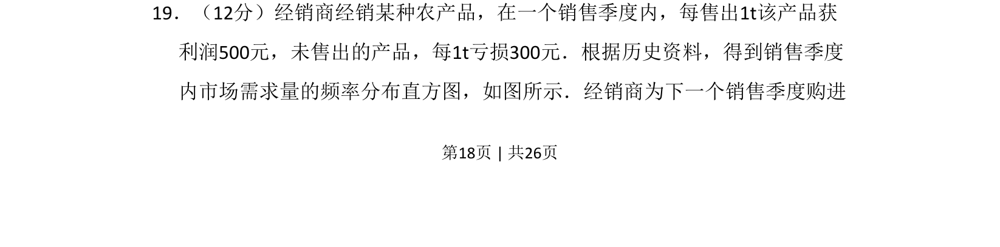
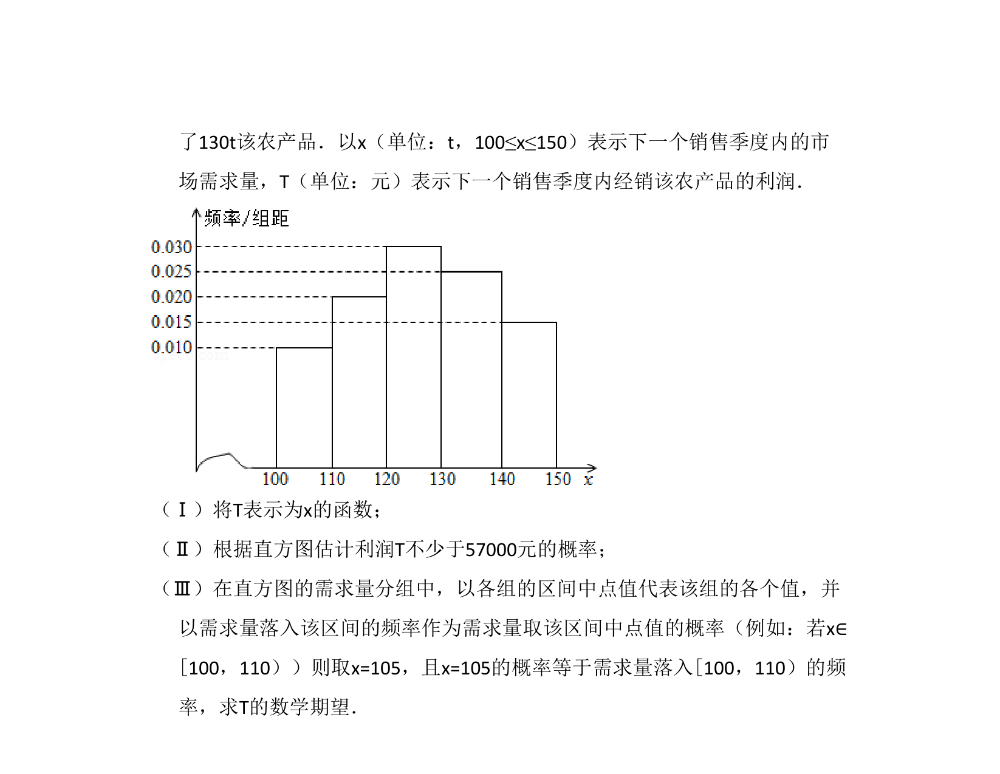
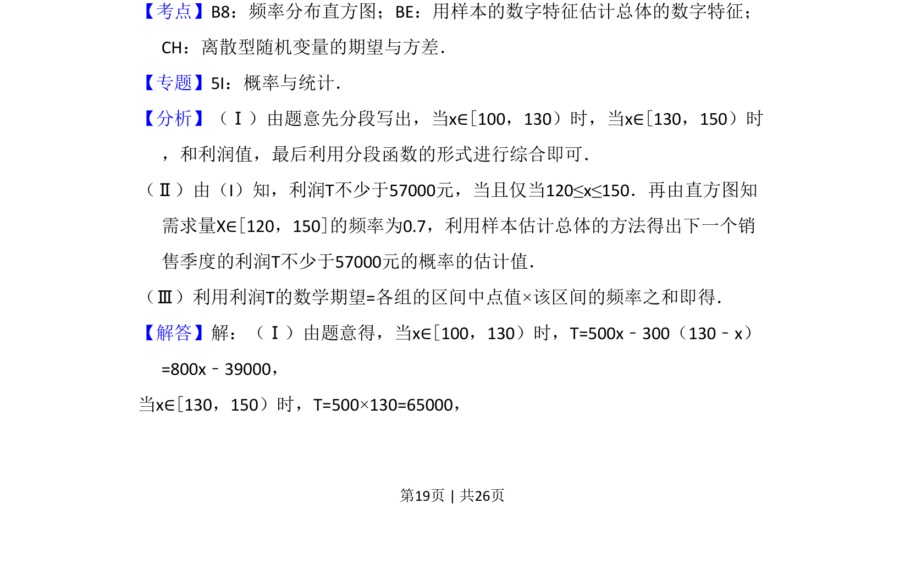
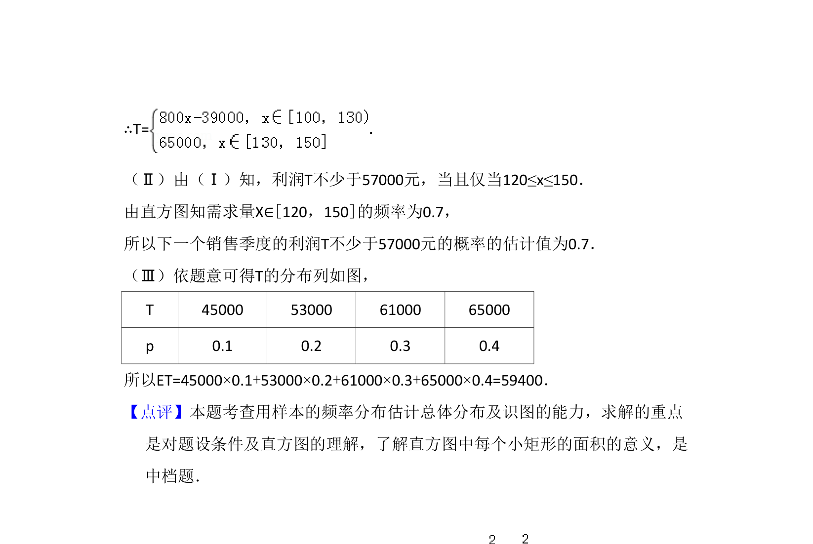

## 题面

## 摘要

经销商根据市场需求频率分布直方图决策进货量，涉及利润与亏损计算。

## 关联考点

- [[364-频率分布直方图|频率分布直方图]]
- [[期望]]
- [[290-分段函数|分段函数]]

## 答案与解析

> 📄 原 PDF 第 18 页：`素材/真题/吉林/2008-2024·（吉林）数学高考真题/2013年高考数学试卷（理）（新课标Ⅱ）（解析卷）.pdf`
