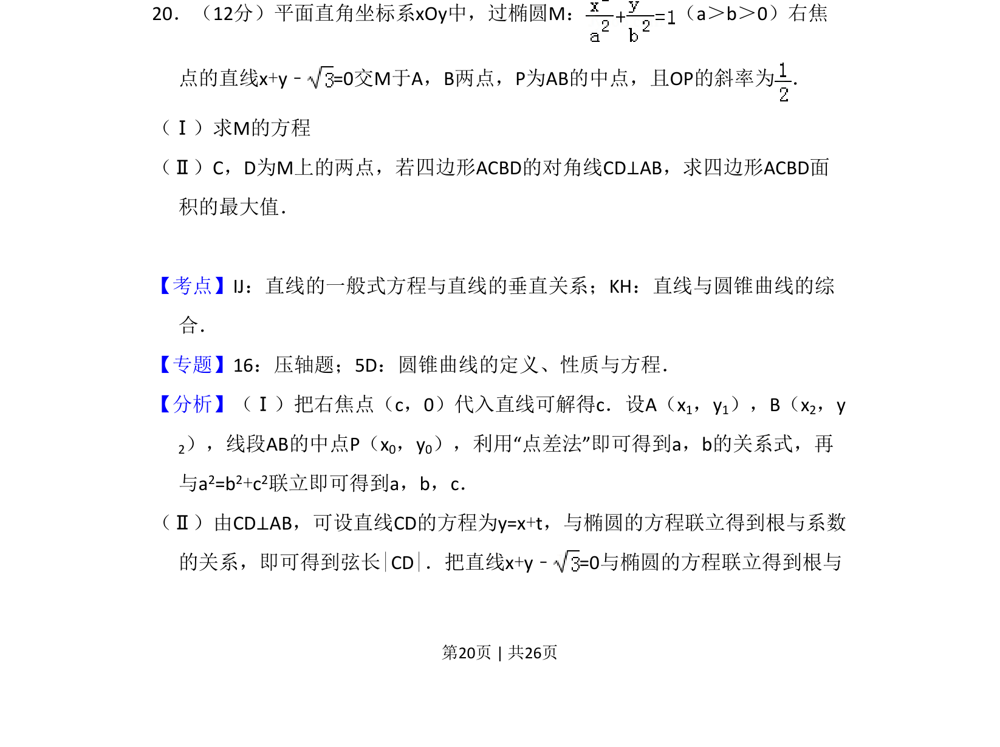
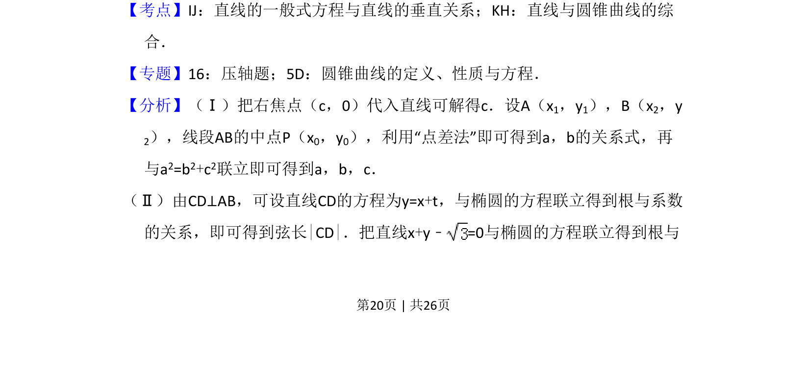
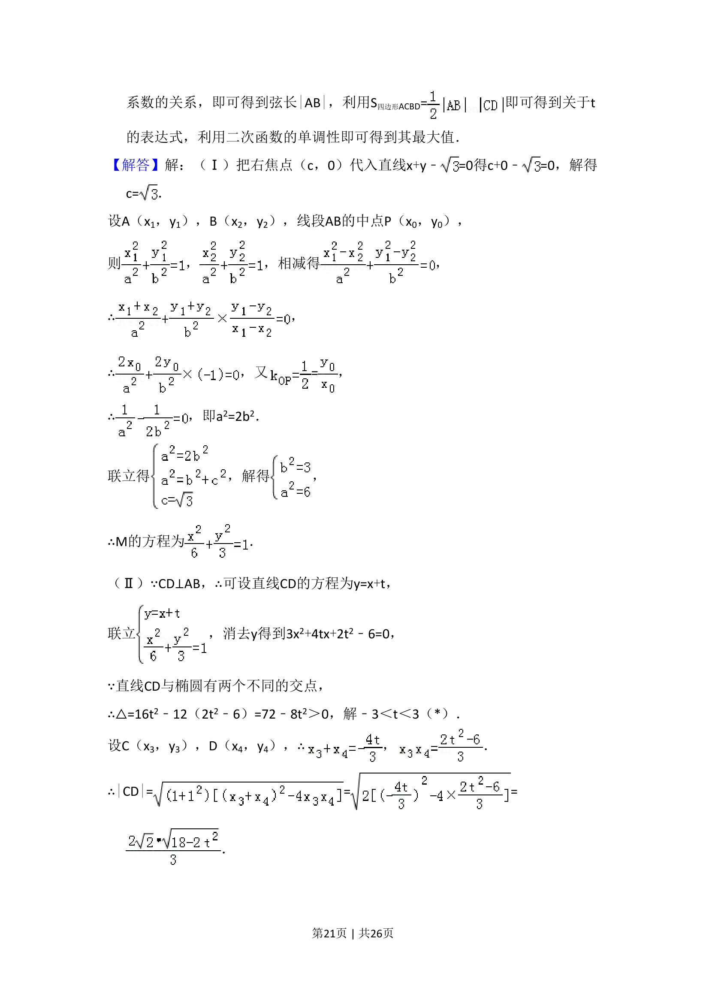
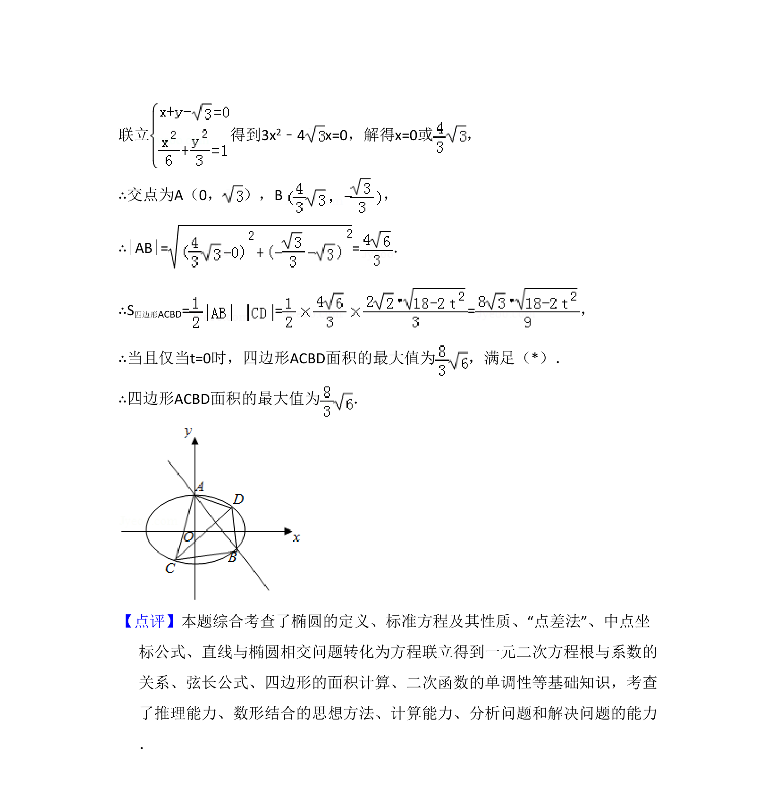

## 题面

## 摘要

本题考查利用点差法求椭圆方程及对角线垂直的四边形面积最大值。

## 关联考点

- [[389-椭圆定义与方程|椭圆]]
- [[点差法]]
- [[直线与圆锥曲线综合]]
- [[面积最值]]

## 答案与解析

> 📄 原 PDF 第 20 页：`素材/真题/吉林/2008-2024·（吉林）数学高考真题/2013年高考数学试卷（理）（新课标Ⅱ）（解析卷）.pdf`
