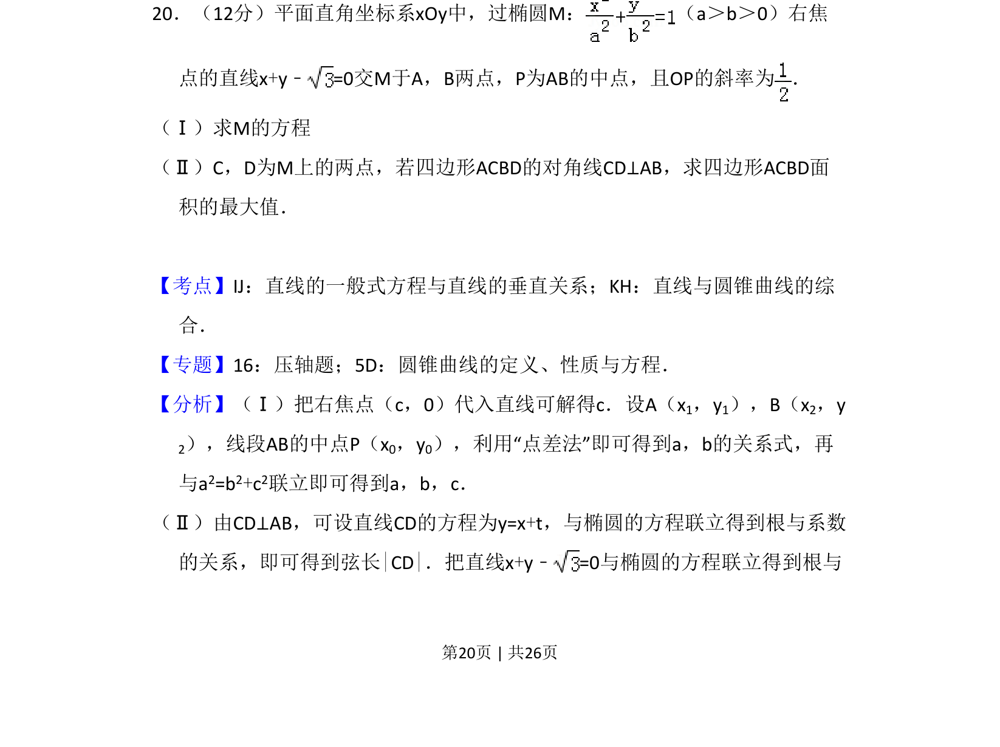
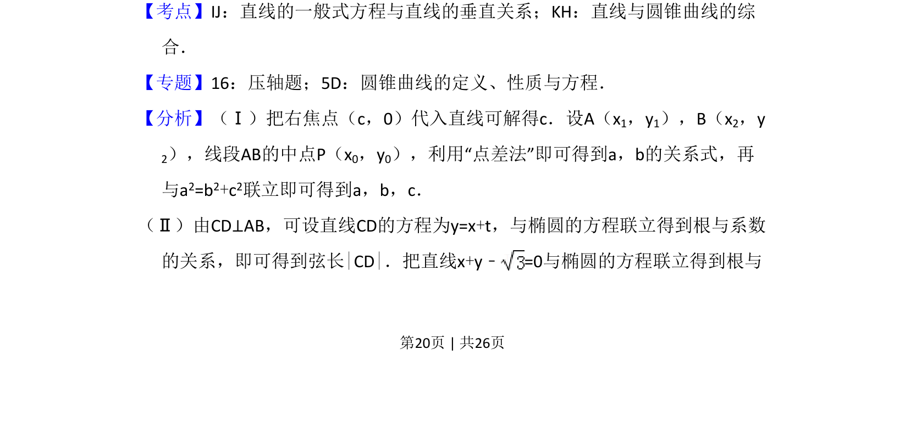
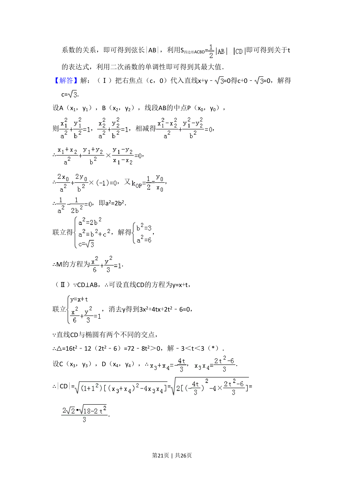
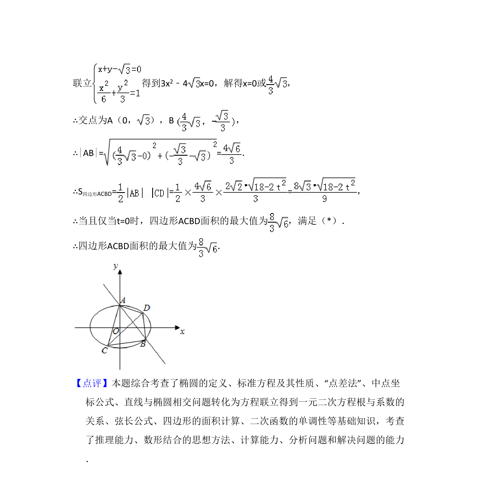

## 题面

## 摘要

本题考查利用点差法求椭圆方程及对角线垂直的四边形面积最大值。

## 关联考点

- [[389-椭圆定义与方程|椭圆]]
- [[1167-点差法|点差法]]
- [[1007-直线与圆锥曲线的综合|直线与圆锥曲线综合]]
- [[1144-面积最值|面积最值]]

## 答案与解析

> 📄 原 PDF 第 20 页：`素材/真题/吉林/2008-2024·（吉林）数学高考真题/2013年高考数学试卷（理）（新课标Ⅱ）（解析卷）.pdf`

<!-- 题干文本-start -->
## 题干文本
20．（12分）平面直角坐标系xOy中，过椭圆M： （a＞b＞0）右焦
点的直线x+y﹣=0交M于A，B两点，P为AB的中点，且OP的斜率为 ．
（Ⅰ）求M的方程
（Ⅱ）C，D为M上的两点，若四边形ACBD的对角线CD⊥AB，求四边形ACBD面
积的最大值．
<!-- 题干文本-end -->

<!-- 解析文本-start -->
## 解析文本
【考点】IJ：直线的一般式方程与直线的垂直关系；KH：直线与圆锥曲线的综
合．菁优网版权所有
【专题】16：压轴题；5D：圆锥曲线的定义、性质与方程．
【分析】（Ⅰ）把右焦点（c，0）代入直线可解得c．设A（x1，y1），B（x2，y
2），线段AB的中点P（x0，y0），利用“点差法”即可得到a，b的关系式，再
与a2=b2+c2联立即可得到a，b，c．
（Ⅱ）由CD⊥AB，可设直线CD的方程为y=x+t，与椭圆的方程联立得到根与系数
的关系，即可得到弦长|CD|．把直线x+y﹣=0与椭圆的方程联立得到根与
<!-- 解析文本-end -->
