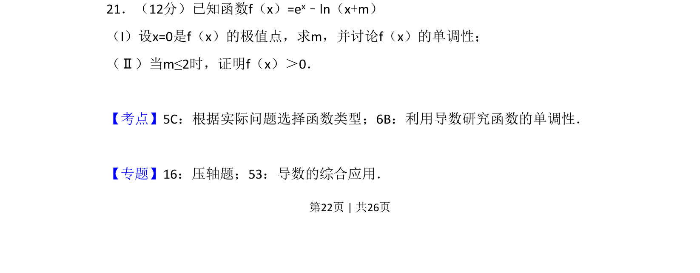
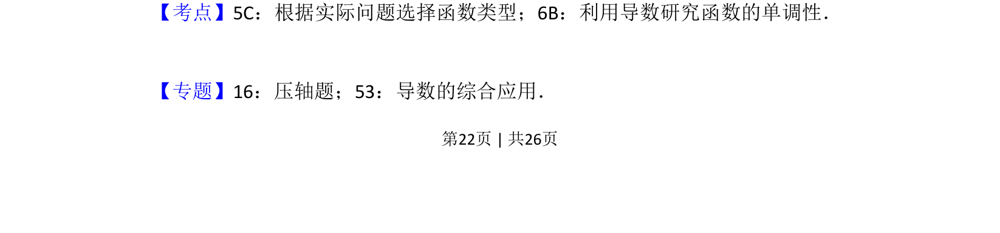
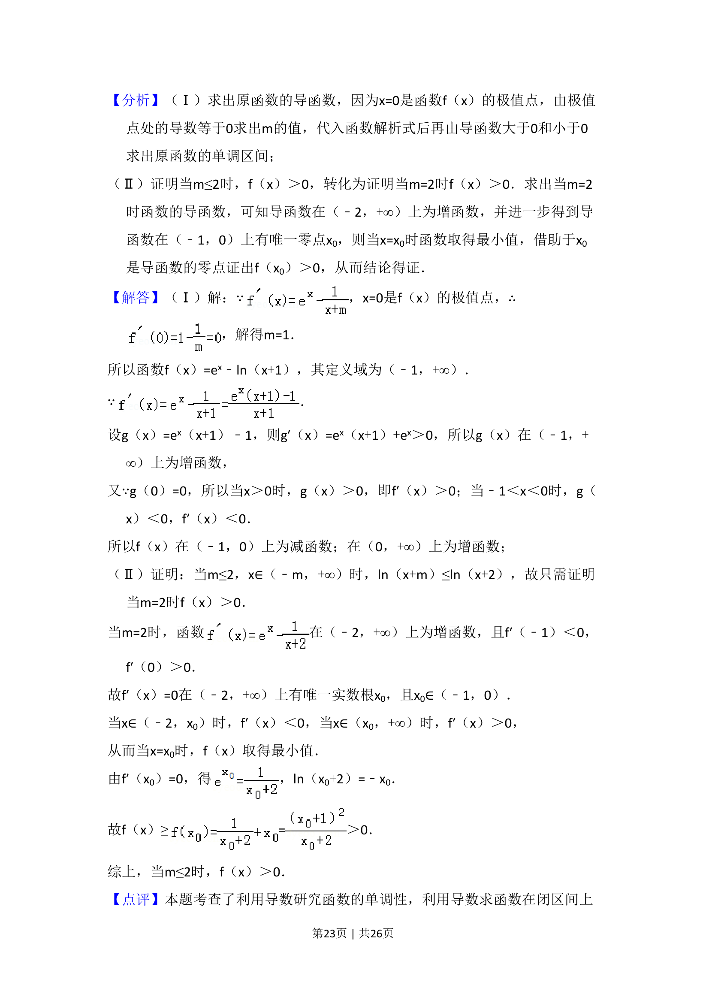
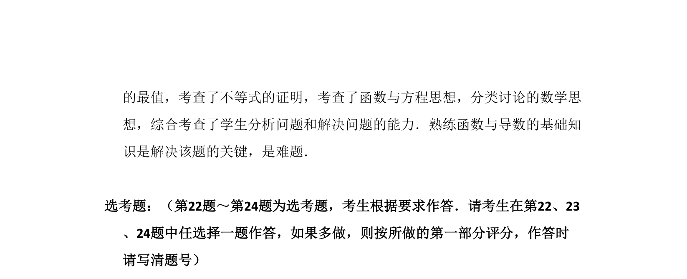

## 题面

## 摘要

本题通过极值点求参数并讨论单调性，再证明函数不等式，综合考查导数应用。

## 关联考点

- [[705-利用导数研究函数的单调性|利用导数研究函数的单调性]]
- [[1174-极值点|极值点]]
- [[674-函数不等式证明|函数不等式证明]]
- [[842-导数的综合应用|导数的综合应用]]

## 答案与解析

> 📄 原 PDF 第 22 页：`素材/真题/吉林/2008-2024·（吉林）数学高考真题/2013年高考数学试卷（理）（新课标Ⅱ）（解析卷）.pdf`
