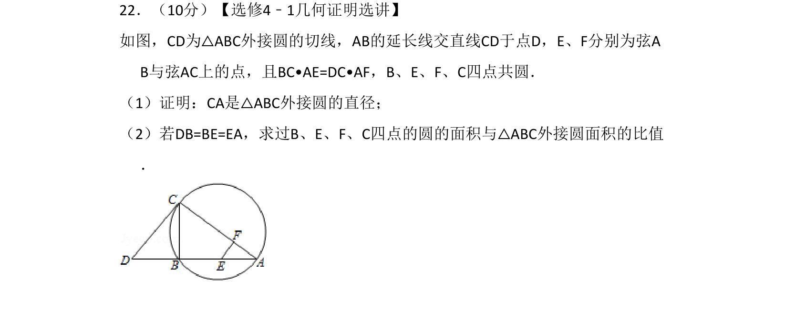
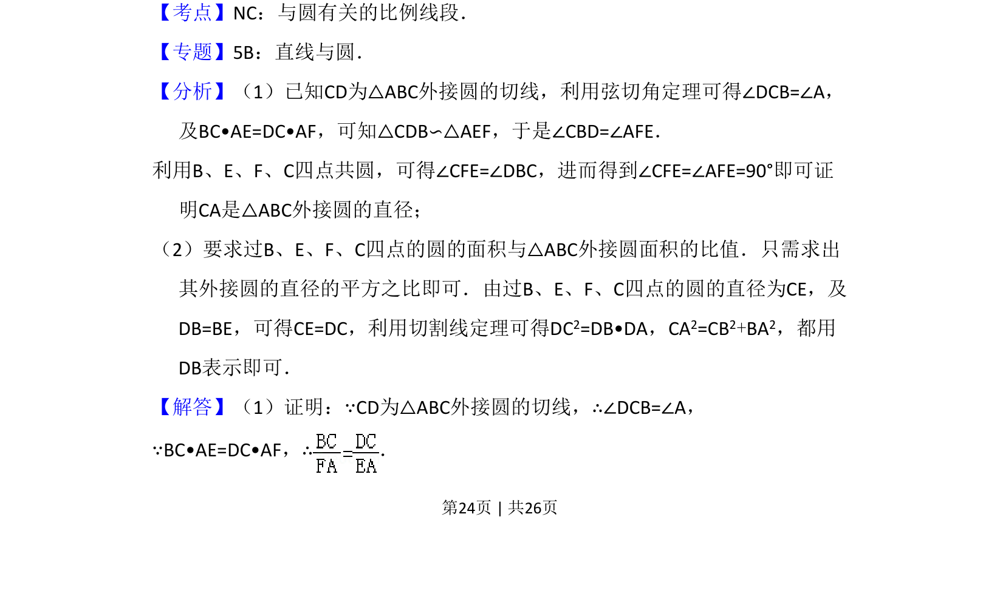

## 题面

## 摘要

该题考查圆的切线性质、相似三角形判定及四点共圆，需证明直径并求两圆面积比。

## 关联考点

- [[弦切角定理]]
- [[相似三角形]]
- [[四点共圆]]
- [[切割线定理]]

## 答案与解析

> 📄 原 PDF 第 24 页：`素材/真题/吉林/2008-2024·（吉林）数学高考真题/2013年高考数学试卷（理）（新课标Ⅱ）（解析卷）.pdf`
