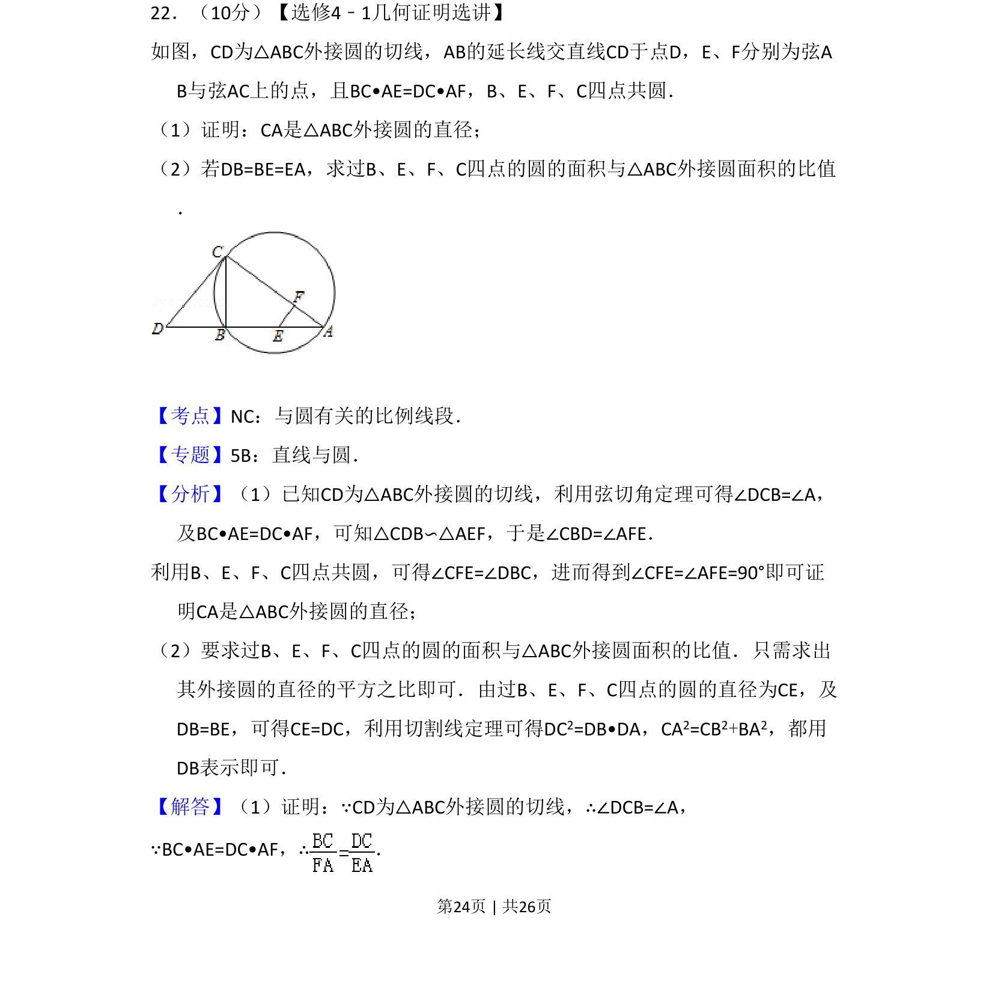
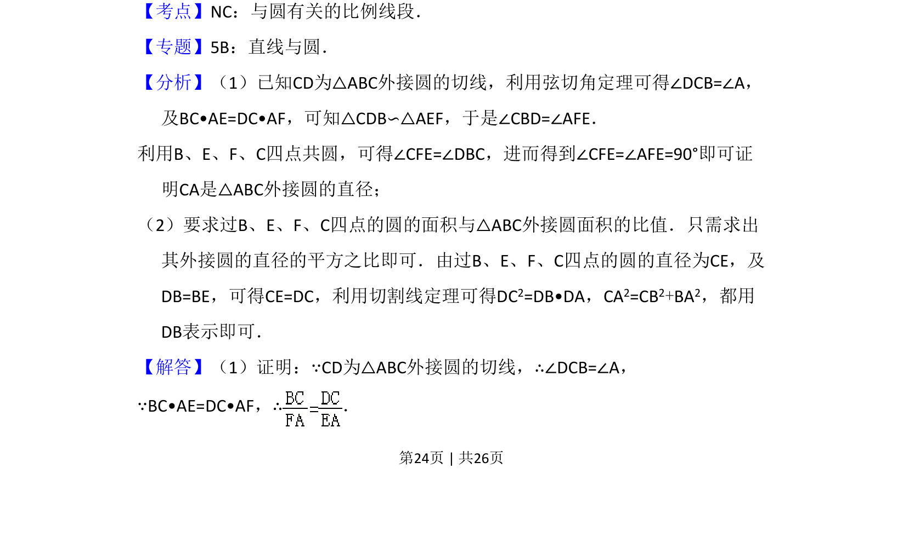
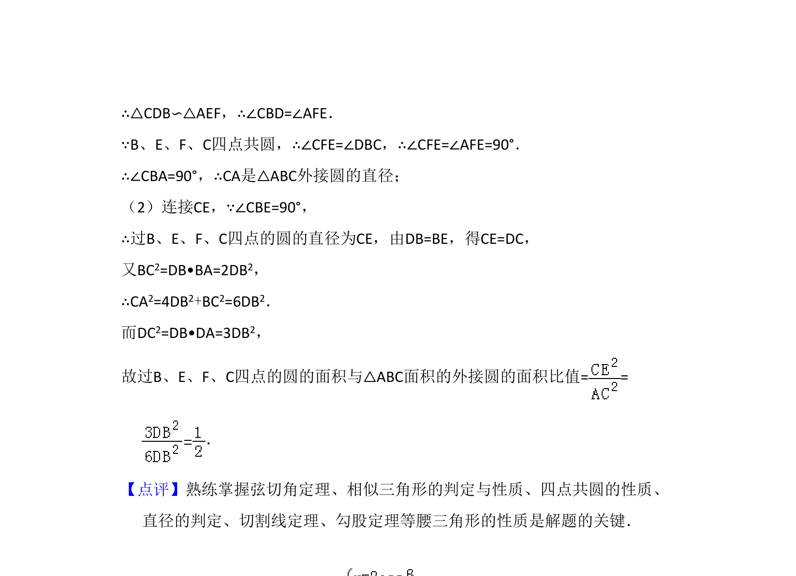

## 题面

## 摘要

该题考查圆的切线性质、相似三角形判定及四点共圆，需证明直径并求两圆面积比。

## 关联考点

- [[863-弦切角定理|弦切角定理]]
- [[1033-相似三角形|相似三角形]]
- [[766-四点共圆|四点共圆]]
- [[700-切割线定理|切割线定理]]

## 答案与解析

> 📄 原 PDF 第 24 页：`素材/真题/吉林/2008-2024·（吉林）数学高考真题/2013年高考数学试卷（理）（新课标Ⅱ）（解析卷）.pdf`

<!-- 题干文本-start -->
## 题干文本
22．（10分）【选修4﹣1几何证明选讲】
如图，CD为△ABC外接圆的切线，AB的延长线交直线CD于点D，E、F分别为弦A
B与弦AC上的点，且BC•AE=DC•AF，B、E、F、C四点共圆．
（1）证明：CA是△ABC外接圆的直径；
（2）若DB=BE=EA，求过B、E、F、C四点的圆的面积与△ABC外接圆面积的比值
．
<!-- 题干文本-end -->

<!-- 解析文本-start -->
## 解析文本
【考点】NC：与圆有关的比例线段．菁优网版权所有
【专题】5B：直线与圆．
【分析】（1）已知CD为△ABC外接圆的切线，利用弦切角定理可得∠DCB=∠A，
及BC•AE=DC•AF，可知△CDB∽△AEF，于是∠CBD=∠AFE．
利用B、E、F、C四点共圆，可得∠CFE=∠DBC，进而得到∠CFE=∠AFE=90°即可证
明CA是△ABC外接圆的直径；
（2）要求过B、E、F、C四点的圆的面积与△ABC外接圆面积的比值．只需求出
其外接圆的直径的平方之比即可．由过B、E、F、C四点的圆的直径为CE，及
DB=BE，可得CE=DC，利用切割线定理可得DC2=DB•DA，CA2=CB2+BA2，都用
DB表示即可．
【解答】（1）证明：∵CD为△ABC外接圆的切线，∴∠DCB=∠A，
∵BC•AE=DC•AF，∴．
<!-- 解析文本-end -->
