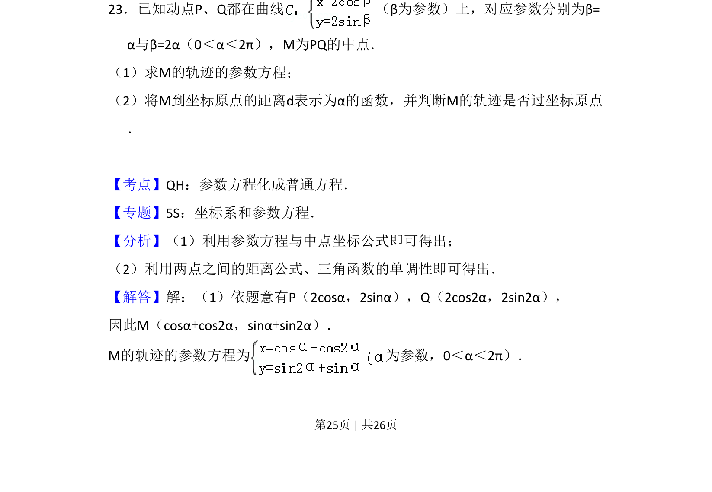
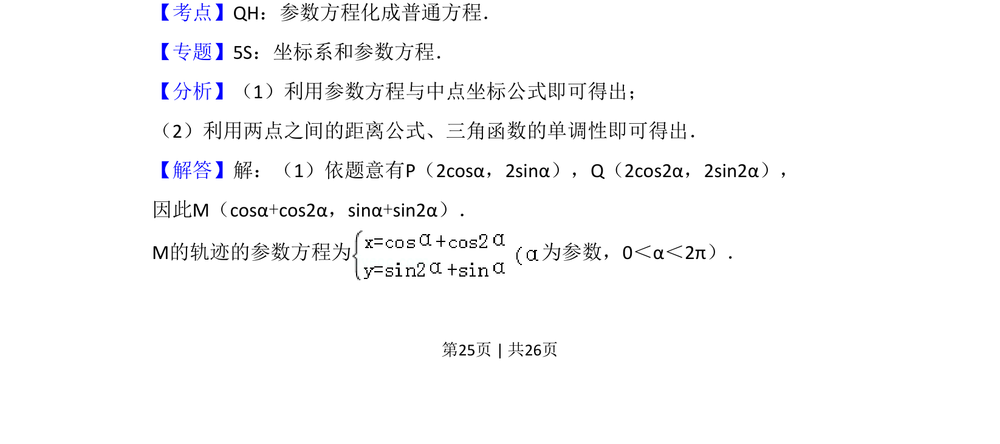
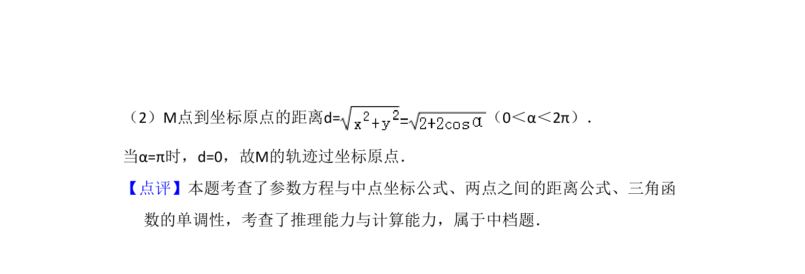

## 题面

## 摘要

本题通过参数方程给出两点，求其中点轨迹的参数方程，并判断轨迹是否过原点。

## 关联考点

- [[061-方程|参数方程]]
- [[635-中点坐标公式|中点坐标公式]]
- [[626-两点间距离公式|两点间距离公式]]

## 答案与解析

> 📄 原 PDF 第 25 页：`素材/真题/吉林/2008-2024·（吉林）数学高考真题/2013年高考数学试卷（理）（新课标Ⅱ）（解析卷）.pdf`
