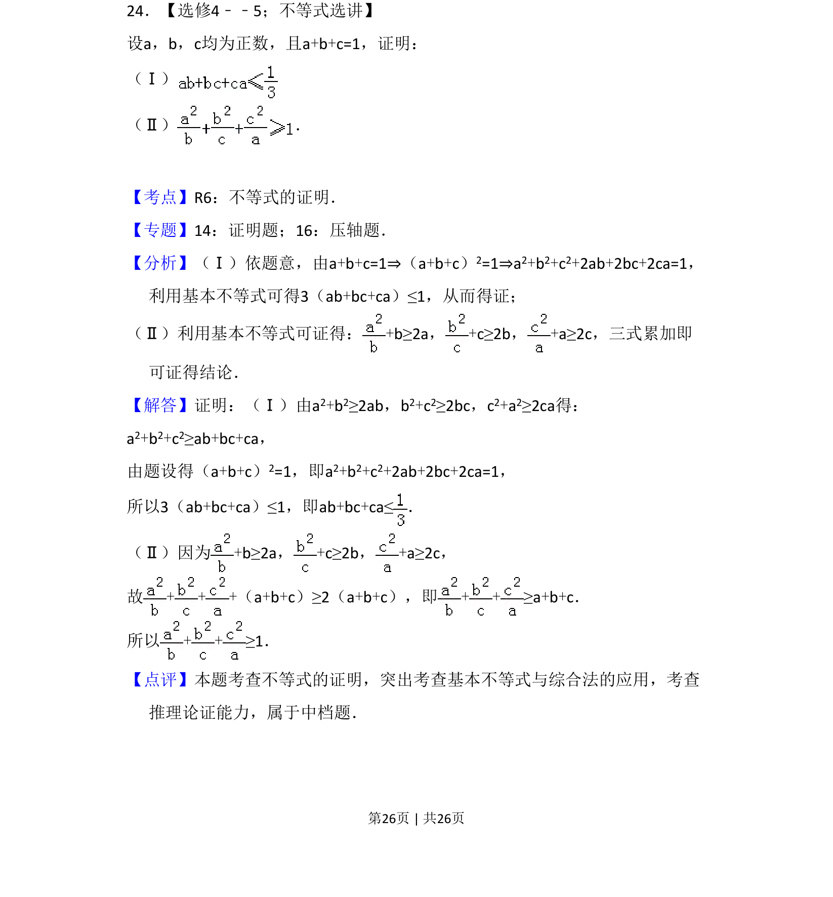
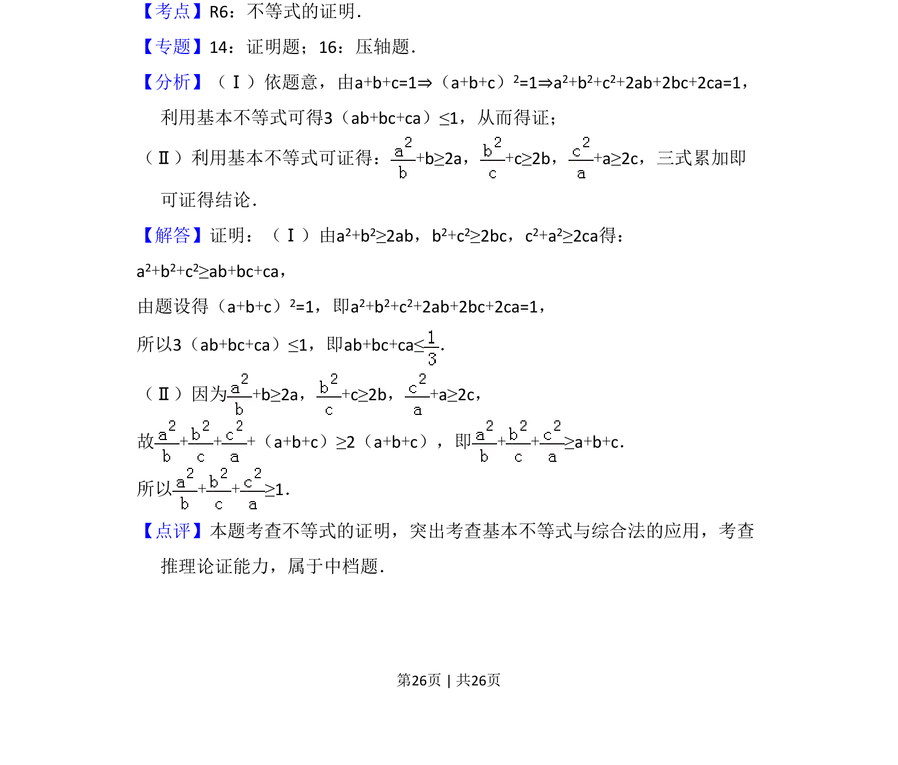

## 题面

## 摘要

证明不等式，利用基本不等式和已知条件 a+b+c=1 推导结论。

## 关联考点

- [[624-不等式的证明|不等式的证明]]
- [[295-基本不等式|基本不等式]]
- [[1100-综合法|综合法]]

## 答案与解析

> 📄 原 PDF 第 26 页：`素材/真题/吉林/2008-2024·（吉林）数学高考真题/2013年高考数学试卷（理）（新课标Ⅱ）（解析卷）.pdf`
