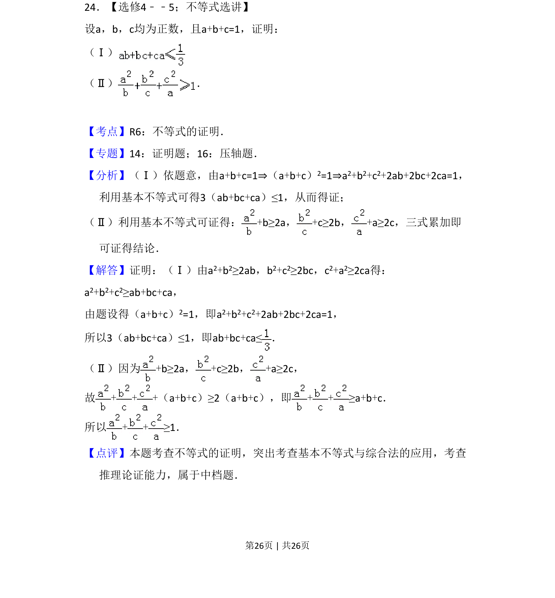
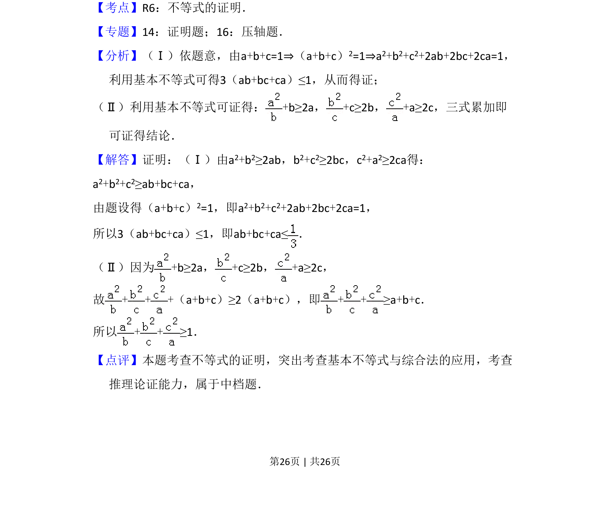

## 题面

## 摘要

证明不等式，利用基本不等式和已知条件 a+b+c=1 推导结论。

## 关联考点

- [[624-不等式的证明|不等式的证明]]
- [[295-基本不等式|基本不等式]]
- [[1099-综合法|综合法]]

## 答案与解析

> 📄 原 PDF 第 26 页：`素材/真题/吉林/2008-2024·（吉林）数学高考真题/2013年高考数学试卷（理）（新课标Ⅱ）（解析卷）.pdf`

<!-- 题干文本-start -->
## 题干文本
24．【选修4﹣﹣5；不等式选讲】
设a，b，c均为正数，且a+b+c=1，证明：
（Ⅰ）
（Ⅱ） ．
<!-- 题干文本-end -->

<!-- 解析文本-start -->
## 解析文本
【考点】R6：不等式的证明．菁优网版权所有
【专题】14：证明题；16：压轴题．
【分析】（Ⅰ）依题意，由a+b+c=1⇒（a+b+c）2=1⇒a2+b2+c2+2ab+2bc+2ca=1，
利用基本不等式可得3（ab+bc+ca）≤1，从而得证；
（Ⅱ）利用基本不等式可证得：+b≥2a，+c≥2b，+a≥2c，三式累加即
可证得结论．
【解答】证明：（Ⅰ）由a2+b2≥2ab，b2+c2≥2bc，c2+a2≥2ca得：
a2+b2+c2≥ab+bc+ca，
由题设得（a+b+c）2=1，即a2+b2+c2+2ab+2bc+2ca=1，
所以3（ab+bc+ca）≤1，即ab+bc+ca≤．
（Ⅱ）因为+b≥2a，+c≥2b，+a≥2c，
故+ + +（a+b+c）≥2（a+b+c），即+ +≥a+b+c．
所以+ +≥1．
【点评】本题考查不等式的证明，突出考查基本不等式与综合法的应用，考查
推理论证能力，属于中档题．
<!-- 解析文本-end -->
