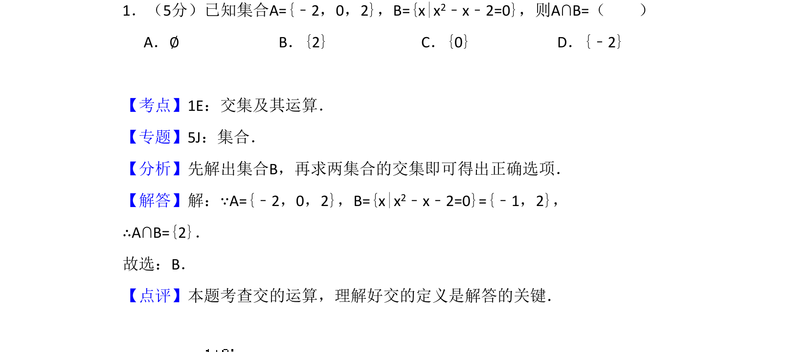
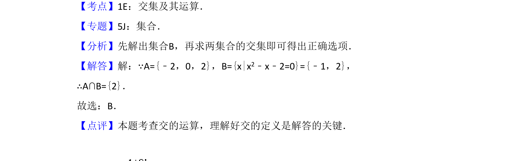

## 题面

## 摘要

考查集合交集运算，涉及二次方程求解。

## 关联考点

- [[645-交集及其运算|交集及其运算]]
- [[042-集合|集合]]
- [[205-一元二次方程|一元二次方程]]

## 答案与解析

> 📄 原 PDF 第 1 页：`素材/真题/吉林/2008-2024·（吉林）数学高考真题/2014年高考数学试卷（文）（新课标Ⅱ）（解析卷）.pdf`

<!-- 题干文本-start -->
## 题干文本
1．（5分）已知集合A={﹣2，0，2}，B={x|x2﹣x﹣2=0}，则A∩B=（　　）
A．∅B．{2}C．{0}D．{﹣2}
<!-- 题干文本-end -->

<!-- 解析文本-start -->
## 解析文本
【考点】1E：交集及其运算．菁优网版权所有
【专题】5J：集合．
【分析】先解出集合B，再求两集合的交集即可得出正确选项．
【解答】解：∵A={﹣2，0，2}，B={x|x2﹣x﹣2=0}={﹣1，2}，
∴A∩B={2}．
故选：B．
【点评】本题考查交的运算，理解好交的定义是解答的关键．
<!-- 解析文本-end -->
