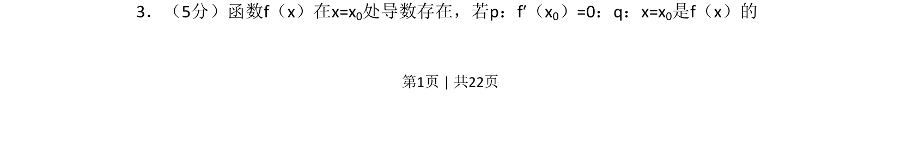
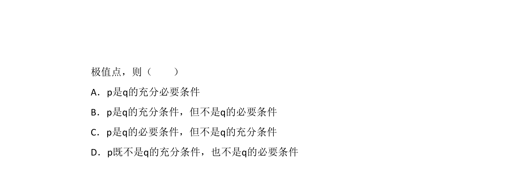
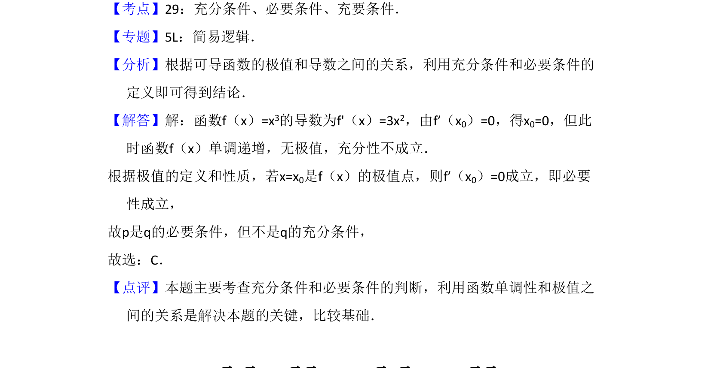

## 题面

## 摘要

函数在某点导数为零与该点为极值点的逻辑关系判断。

## 关联考点

- [[425-反函数导数|导数]]
- [[1174-极值点|极值点]]
- [[533-充分必要条件|充分必要条件]]

## 答案与解析

> 📄 原 PDF 第 1 页：`素材/真题/吉林/2008-2024·（吉林）数学高考真题/2014年高考数学试卷（文）（新课标Ⅱ）（解析卷）.pdf`
