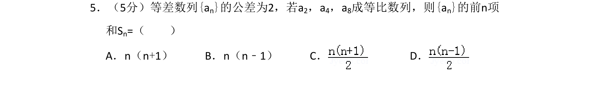
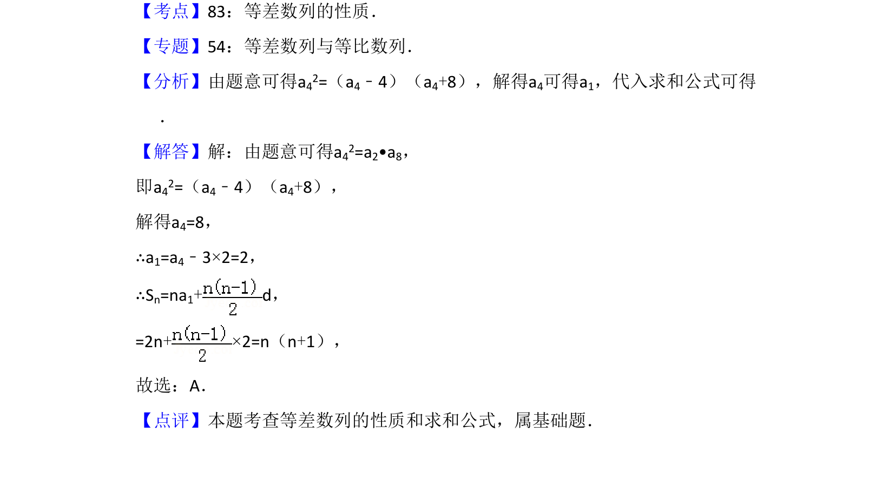

## 题面

## 摘要

等差数列通项与等比中项结合求前n项和公式

## 关联考点

- [[412-等差数列性质|等差数列性质]]
- [[1064-等比中项|等比中项]]
- [[1059-等差数列求和公式|等差数列求和公式]]

## 答案与解析

> 📄 原 PDF 第 3 页：`素材/真题/吉林/2008-2024·（吉林）数学高考真题/2014年高考数学试卷（文）（新课标Ⅱ）（解析卷）.pdf`

<!-- 题干文本-start -->
## 题干文本
5．（5分）等差数列{an}的公差为2，若a2，a4，a8成等比数列，则{an}的前n项
和Sn=（　　）
A．n（n+1）B．n（n﹣1）C．D．
<!-- 题干文本-end -->

<!-- 解析文本-start -->
## 解析文本
【考点】83：等差数列的性质．菁优网版权所有
【专题】54：等差数列与等比数列．
【分析】由题意可得a42=（a4﹣4）（a4+8），解得a4可得a1，代入求和公式可得
．
【解答】解：由题意可得a42=a2•a8，
即a42=（a4﹣4）（a4+8），
解得a4=8，
∴a1=a4﹣3×2=2，
∴Sn=na1+d，
=2n+×2=n（n+1），
故选：A．
【点评】本题考查等差数列的性质和求和公式，属基础题．
<!-- 解析文本-end -->
