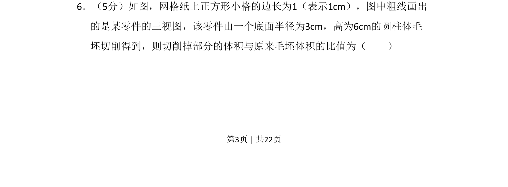
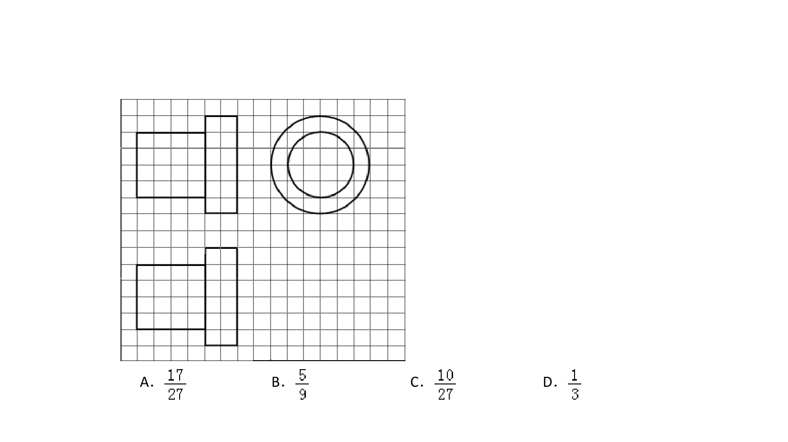
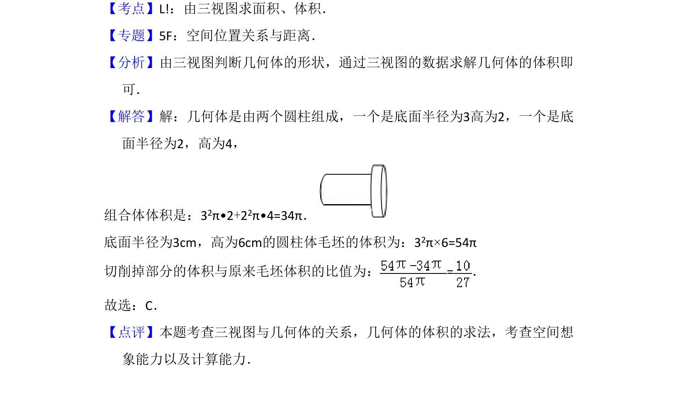

## 题面

## 摘要

通过三视图还原零件形状，计算圆柱体毛坯与切削后零件的体积比。

## 关联考点

- [[235-三视图|三视图]]
- [[652-体积计算|体积计算]]
- [[775-圆柱体|圆柱体]]

## 答案与解析

> 📄 原 PDF 第 3 页：`素材/真题/吉林/2008-2024·（吉林）数学高考真题/2014年高考数学试卷（文）（新课标Ⅱ）（解析卷）.pdf`
