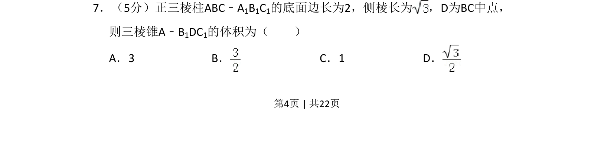
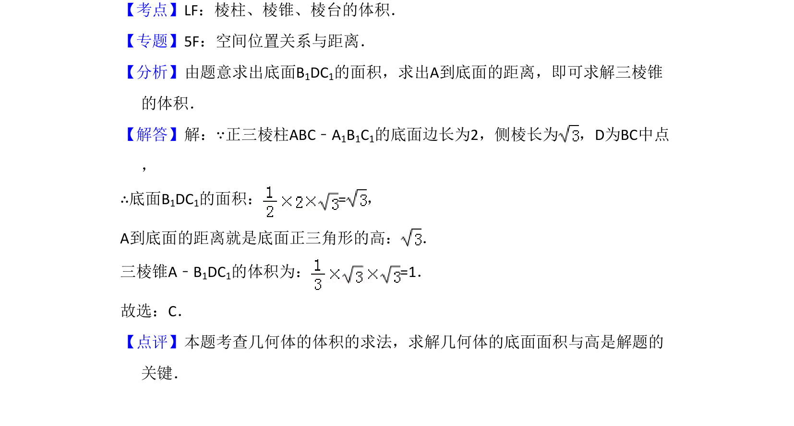

## 题面

## 摘要

求正三棱柱内三棱锥的体积，可用等体积法或直接计算底面积与高求解。

## 关联考点

- [[934-棱柱与棱锥的体积计算|棱柱与棱锥的体积计算]]
- [[1046-空间几何体|空间几何体]]
- [[1058-等体积法|等体积法]]
- [[1197-点面距离计算|点到平面的距离]]

## 答案与解析

> 📄 原 PDF 第 4 页：`素材/真题/吉林/2008-2024·（吉林）数学高考真题/2014年高考数学试卷（文）（新课标Ⅱ）（解析卷）.pdf`
