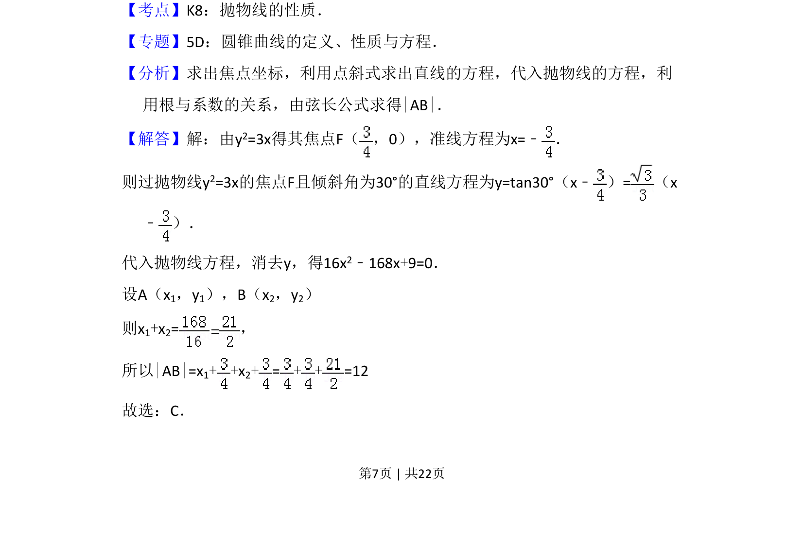

## 题面

## 摘要

本题考查抛物线焦点弦长度的计算，通过焦点和倾斜角求直线方程，联立抛物线利用弦长公式求解。

## 关联考点

- [[378-抛物线几何性质|抛物线性质]]
- [[380-抛物线焦点弦|焦点弦]]
- [[弦长公式]]
- [[234-韦达定理-初中|韦达定理]]

## 答案与解析

> 📄 原 PDF 第 7 页：`素材/真题/吉林/2008-2024·（吉林）数学高考真题/2014年高考数学试卷（文）（新课标Ⅱ）（解析卷）.pdf`
