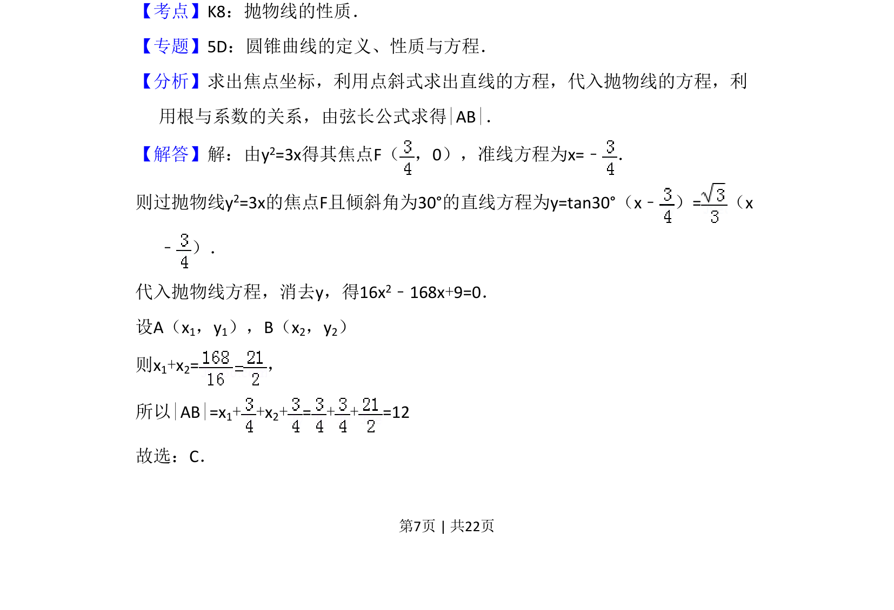
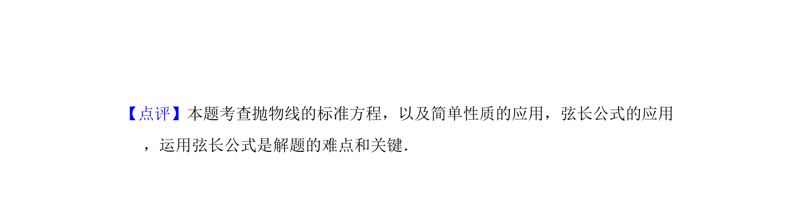

## 题面

## 摘要

本题考查抛物线焦点弦长度的计算，通过焦点和倾斜角求直线方程，联立抛物线利用弦长公式求解。

## 关联考点

- [[378-抛物线几何性质|抛物线性质]]
- [[380-抛物线焦点弦|焦点弦]]
- [[867-弦长公式|弦长公式]]
- [[234-韦达定理-初中|韦达定理]]

## 答案与解析

> 📄 原 PDF 第 7 页：`素材/真题/吉林/2008-2024·（吉林）数学高考真题/2014年高考数学试卷（文）（新课标Ⅱ）（解析卷）.pdf`

<!-- 题干文本-start -->
## 题干文本
10．（5分）设F为抛物线C：y2=3x的焦点，过F且倾斜角为30°的直线交于C于A
，B两点，则|AB|=（　　）
A．B．6 C．12 D．7
<!-- 题干文本-end -->

<!-- 解析文本-start -->
## 解析文本
【考点】K8：抛物线的性质．菁优网版权所有
【专题】5D：圆锥曲线的定义、性质与方程．
【分析】求出焦点坐标，利用点斜式求出直线的方程，代入抛物线的方程，利
用根与系数的关系，由弦长公式求得|AB|．
【解答】解：由y2=3x得其焦点F（ ，0），准线方程为x=﹣ ．
则过抛物线y2=3x的焦点F且倾斜角为30°的直线方程为y=tan30°（x﹣ ）=（x
﹣ ）．
代入抛物线方程，消去y，得16x2﹣168x+9=0．
设A（x1，y1），B（x2，y2）
则x1+x2=，
所以|AB|=x1+ +x 2+=+ +=12
故选：C．
<!-- 解析文本-end -->
