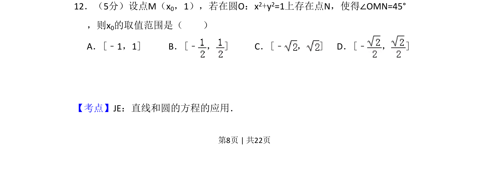
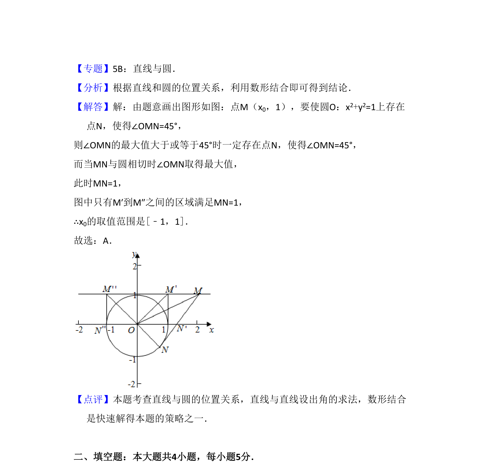

## 题面

## 摘要

本题考查已知圆上点与圆外点夹角为定值时，求参数取值范围，综合应用直线与圆的方程及几何转化。

## 关联考点

- [[576-直线和圆的方程|直线和圆的方程]]
- [[1105-角度约束|角度约束]]
- [[428-存在性问题|存在性问题]]
- [[726-参数范围|参数范围]]

## 答案与解析

> 📄 原 PDF 第 8 页：`素材/真题/吉林/2008-2024·（吉林）数学高考真题/2014年高考数学试卷（文）（新课标Ⅱ）（解析卷）.pdf`

<!-- 题干文本-start -->
## 题干文本
12．（5分）设点M（x0，1），若在圆O：x2+y2=1上存在点N，使得∠OMN=45°
，则x0的取值范围是（　　）
A．[﹣1，1]B．[﹣ ，]C．[﹣ ，]D．[﹣ ，]
<!-- 题干文本-end -->

<!-- 解析文本-start -->
## 解析文本
【考点】JE：直线和圆的方程的应用．菁优网版权所有
<!-- 解析文本-end -->
