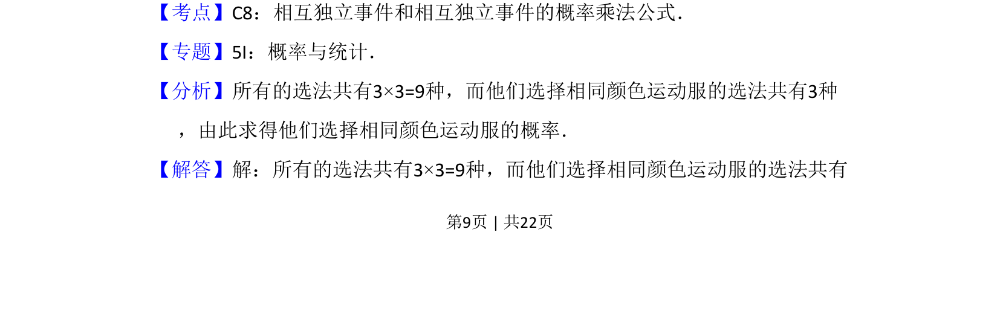
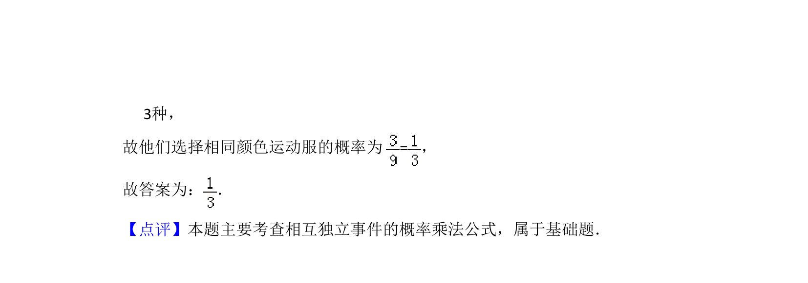

## 题面

## 摘要

甲、乙各自等可能选衣，求选同色概率，利用独立事件乘法公式计算。

## 关联考点

- [[468-事件相互独立性-高中|相互独立事件]]
- [[946-概率乘法公式|概率乘法公式]]
- [[320-古典概型|古典概型]]

## 答案与解析

> 📄 原 PDF 第 9 页：`素材/真题/吉林/2008-2024·（吉林）数学高考真题/2014年高考数学试卷（文）（新课标Ⅱ）（解析卷）.pdf`
