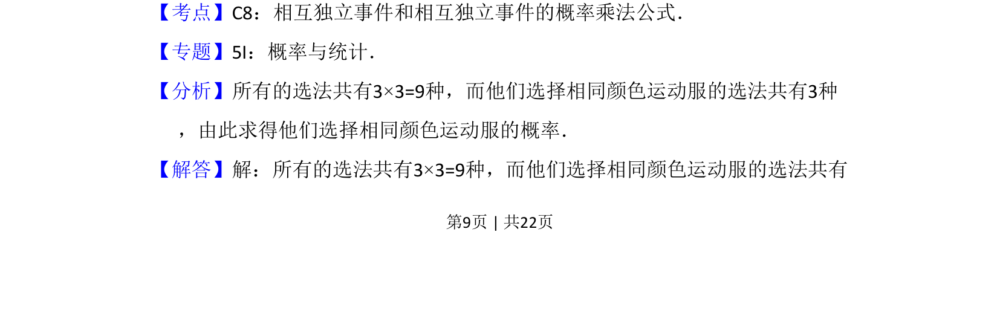
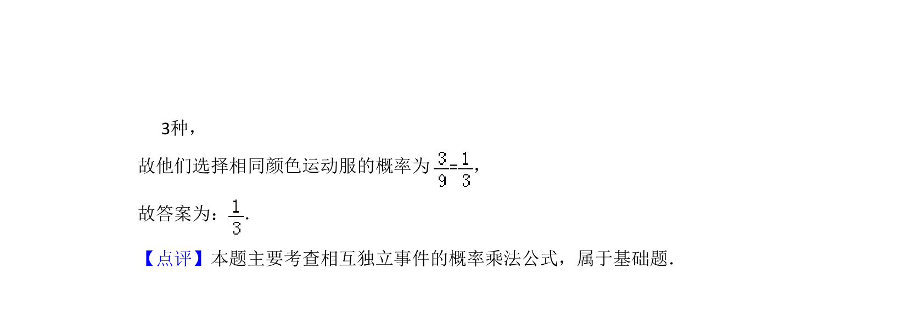

## 题面

## 摘要

甲、乙各自等可能选衣，求选同色概率，利用独立事件乘法公式计算。

## 关联考点

- [[468-事件相互独立性-高中|相互独立事件]]
- [[946-概率乘法公式|概率乘法公式]]
- [[320-古典概型|古典概型]]

## 答案与解析

> 📄 原 PDF 第 9 页：`素材/真题/吉林/2008-2024·（吉林）数学高考真题/2014年高考数学试卷（文）（新课标Ⅱ）（解析卷）.pdf`

<!-- 题干文本-start -->
## 题干文本
13．（5分）甲、乙两名运动员各自等可能地从红、白、蓝3种颜色的运动服中
选择1种，则他们选择相同颜色运动服的概率为　 　．
<!-- 题干文本-end -->

<!-- 解析文本-start -->
## 解析文本
【考点】C8：相互独立事件和相互独立事件的概率乘法公式．菁优网版权所有
【专题】5I：概率与统计．
【分析】所有的选法共有3×3=9种，而他们选择相同颜色运动服的选法共有3种
，由此求得他们选择相同颜色运动服的概率．
【解答】解：所有的选法共有3×3=9种，而他们选择相同颜色运动服的选法共有
<!-- 解析文本-end -->
