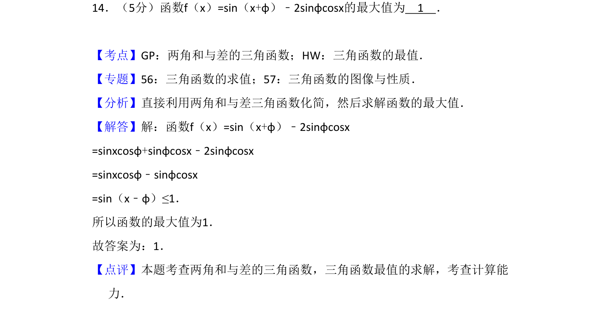
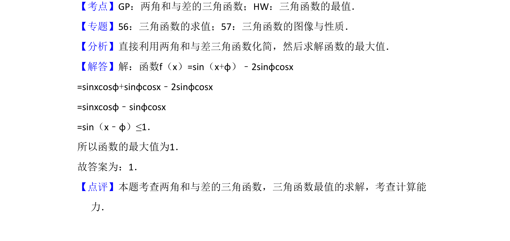

## 题面

## 摘要

本题考查利用两角和与差的三角函数公式化简函数，并求三角函数的最大值。

## 关联考点

- [[628-两角和与差的三角函数|两角和与差的三角函数]]
- [[615-三角函数的最值|三角函数的最值]]

## 答案与解析

> 📄 原 PDF 第 10 页：`素材/真题/吉林/2008-2024·（吉林）数学高考真题/2014年高考数学试卷（文）（新课标Ⅱ）（解析卷）.pdf`
