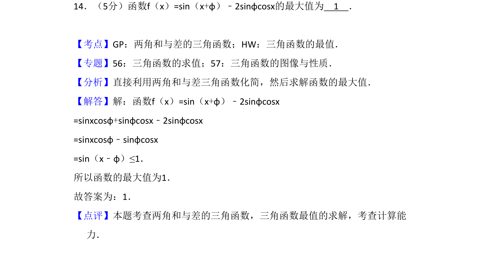
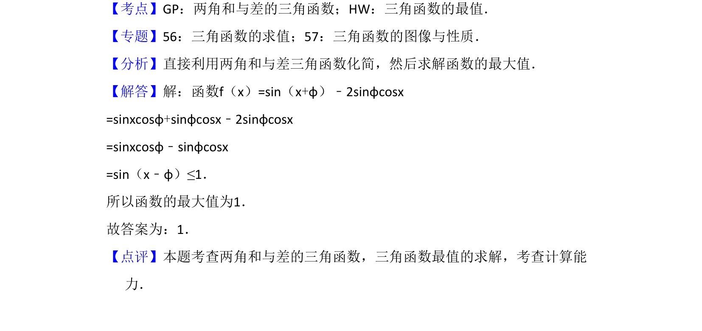

## 题面

## 摘要

本题考查利用两角和与差的三角函数公式化简函数，并求三角函数的最大值。

## 关联考点

- [[628-两角和与差的三角函数|两角和与差的三角函数]]
- [[615-三角函数的最值|三角函数的最值]]

## 答案与解析

> 📄 原 PDF 第 10 页：`素材/真题/吉林/2008-2024·（吉林）数学高考真题/2014年高考数学试卷（文）（新课标Ⅱ）（解析卷）.pdf`

<!-- 题干文本-start -->
## 题干文本
14．（5分）函数f（x）=sin（x+φ）﹣2sinφcosx的最大值为　1　．
<!-- 题干文本-end -->

<!-- 解析文本-start -->
## 解析文本
【考点】GP：两角和与差的三角函数；HW：三角函数的最值．菁优网版权所有
【专题】56：三角函数的求值；57：三角函数的图像与性质．
【分析】直接利用两角和与差三角函数化简，然后求解函数的最大值．
【解答】解：函数f（x）=sin（x+φ）﹣2sinφcosx
=sinxcosφ+sinφcosx﹣2sinφcosx
=sinxcosφ﹣sinφcosx
=sin（x﹣φ）≤1．
所以函数的最大值为1．
故答案为：1．
【点评】本题考查两角和与差的三角函数，三角函数最值的求解，考查计算能
力．
<!-- 解析文本-end -->
