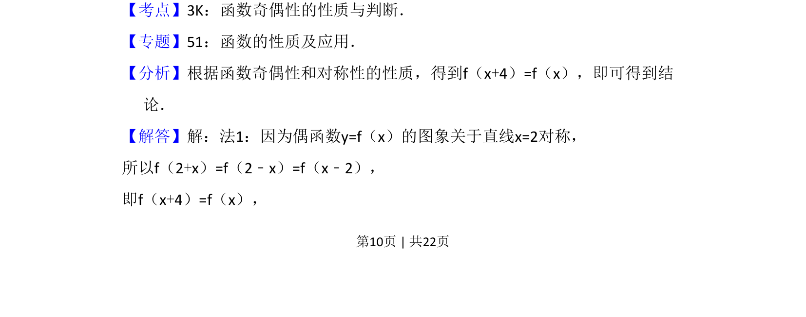
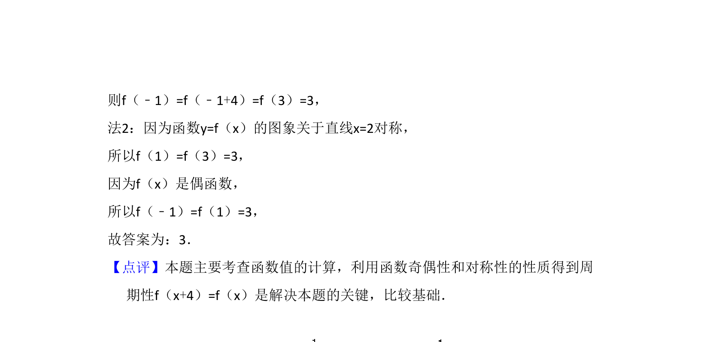

## 题面

## 摘要

本题通过函数奇偶性与对称性推导周期性，求函数值。

## 关联考点

- [[679-函数奇偶性|函数奇偶性]]
- [[681-函数对称性|函数对称性]]
- [[761-周期性|周期性]]

## 答案与解析

> 📄 原 PDF 第 10 页：`素材/真题/吉林/2008-2024·（吉林）数学高考真题/2014年高考数学试卷（文）（新课标Ⅱ）（解析卷）.pdf`
