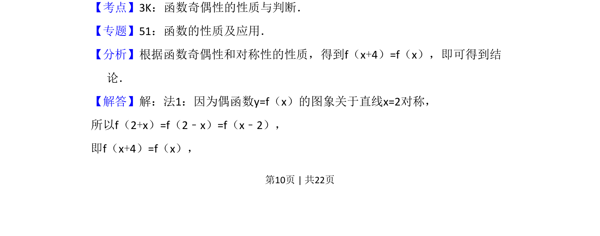
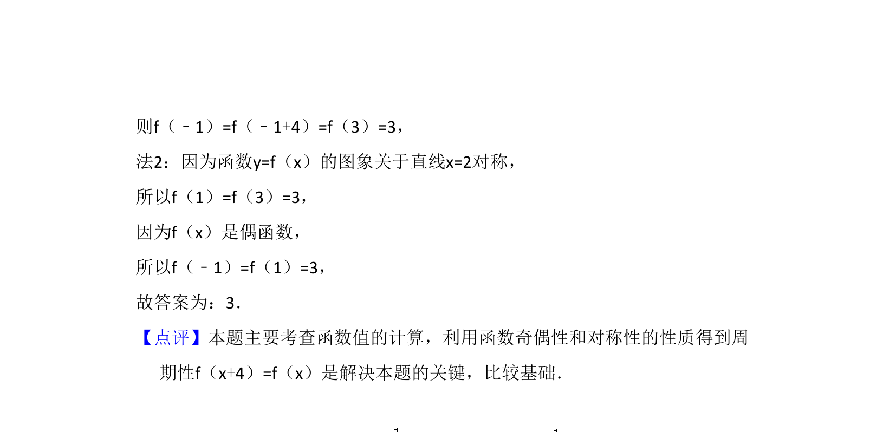

## 题面

## 摘要

本题通过函数奇偶性与对称性推导周期性，求函数值。

## 关联考点

- [[284-函数的奇偶性|函数奇偶性]]
- [[681-函数对称性|函数对称性]]
- [[761-周期性|周期性]]

## 答案与解析

> 📄 原 PDF 第 10 页：`素材/真题/吉林/2008-2024·（吉林）数学高考真题/2014年高考数学试卷（文）（新课标Ⅱ）（解析卷）.pdf`

<!-- 题干文本-start -->
## 题干文本
15．（5分）偶函数y=f（x）的图象关于直线x=2对称，f（3）=3，则f（﹣1）=　
3　．
<!-- 题干文本-end -->

<!-- 解析文本-start -->
## 解析文本
【考点】3K：函数奇偶性的性质与判断．菁优网版权所有
【专题】51：函数的性质及应用．
【分析】根据函数奇偶性和对称性的性质，得到f（x+4）=f（x），即可得到结
论．
【解答】解：法1：因为偶函数y=f（x）的图象关于直线x=2对称，
所以f（2+x）=f（2﹣x）=f（x﹣2），
即f（x+4）=f（x），
<!-- 解析文本-end -->
