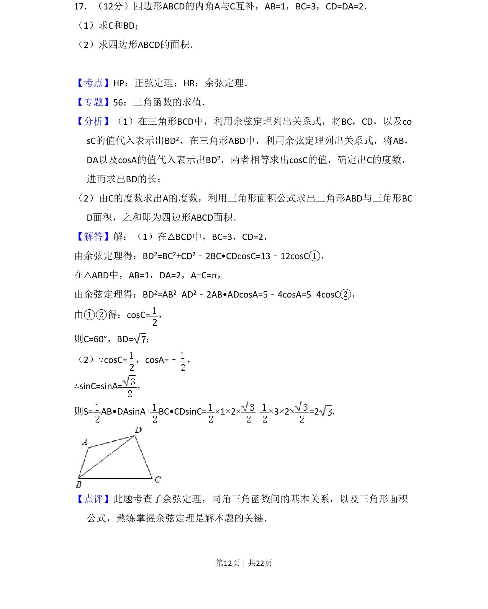
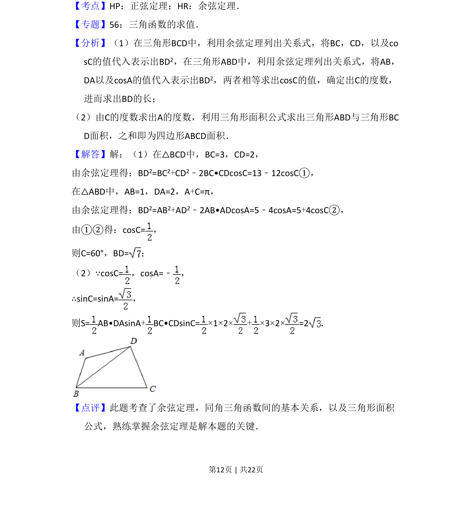

## 题面

## 摘要

利用余弦定理和互补角关系求四边形边长及角度，再计算面积。

## 关联考点

- [[126-定理|余弦定理]]
- [[126-定理|正弦定理]]
- [[062-多边形面积|三角形面积]]
- [[532-互补角关系|互补角关系]]

## 答案与解析

> 📄 原 PDF 第 12 页：`素材/真题/吉林/2008-2024·（吉林）数学高考真题/2014年高考数学试卷（文）（新课标Ⅱ）（解析卷）.pdf`
