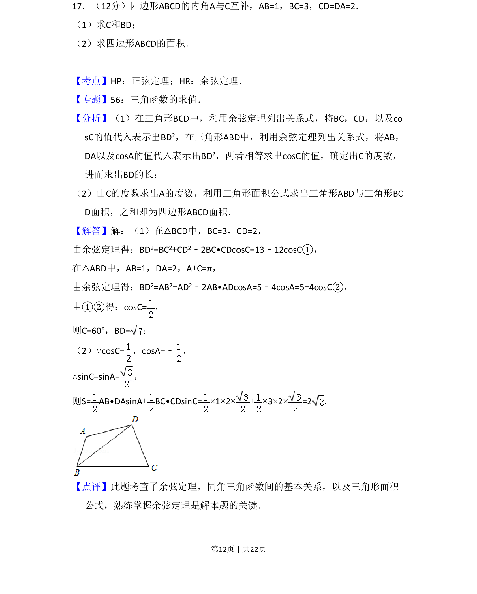
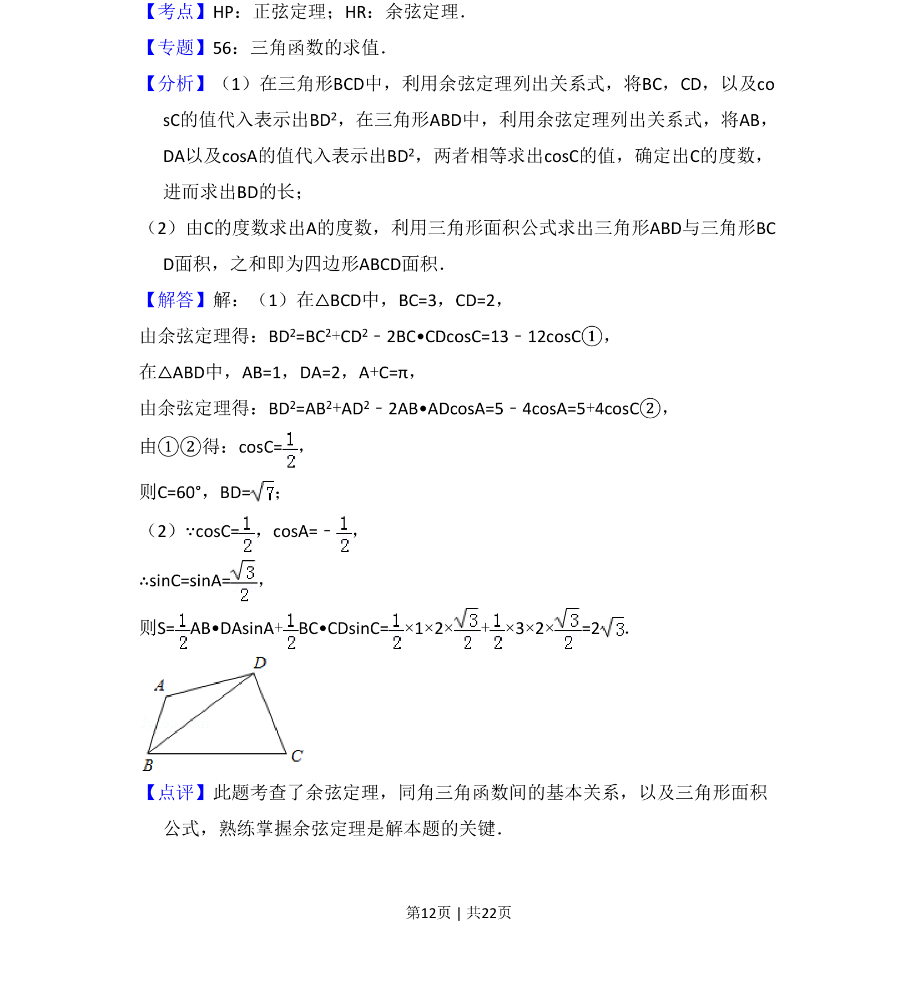

## 题面

## 摘要

利用余弦定理和互补角关系求四边形边长及角度，再计算面积。

## 关联考点

- [[126-定理|余弦定理]]
- [[126-定理|正弦定理]]
- [[062-多边形面积|三角形面积]]
- [[532-互补角关系|互补角关系]]

## 答案与解析

> 📄 原 PDF 第 12 页：`素材/真题/吉林/2008-2024·（吉林）数学高考真题/2014年高考数学试卷（文）（新课标Ⅱ）（解析卷）.pdf`

<!-- 题干文本-start -->
## 题干文本
17．（12分）四边形ABCD的内角A与C互补，AB=1，BC=3，CD=DA=2．
（1）求C和BD；
（2）求四边形ABCD的面积．
<!-- 题干文本-end -->

<!-- 解析文本-start -->
## 解析文本
【考点】HP：正弦定理；HR：余弦定理．菁优网版权所有
【专题】56：三角函数的求值．
【分析】（1）在三角形BCD中，利用余弦定理列出关系式，将BC，CD，以及co
sC的值代入表示出BD2，在三角形ABD中，利用余弦定理列出关系式，将AB，
DA以及cosA的值代入表示出BD2，两者相等求出cosC的值，确定出C的度数，
进而求出BD的长；
（2）由C的度数求出A的度数，利用三角形面积公式求出三角形ABD与三角形BC
D面积，之和即为四边形ABCD面积．
【解答】解：（1）在△BCD中，BC=3，CD=2，
由余弦定理得：BD2=BC2+CD2﹣2BC•CDcosC=13﹣12cosC①，
在△ABD中，AB=1，DA=2，A+C=π，
由余弦定理得：BD2=AB2+AD2﹣2AB•ADcosA=5﹣4cosA=5+4cosC②，
由①②得：cosC=，
则C=60°，BD=；
（2）∵cosC=，cosA=﹣ ，
∴sinC=sinA=，
则S= AB•DAsinA+BC•CDsinC=×1×2×+×3×2×=2．
【点评】此题考查了余弦定理，同角三角函数间的基本关系，以及三角形面积
公式，熟练掌握余弦定理是解本题的关键．
<!-- 解析文本-end -->
