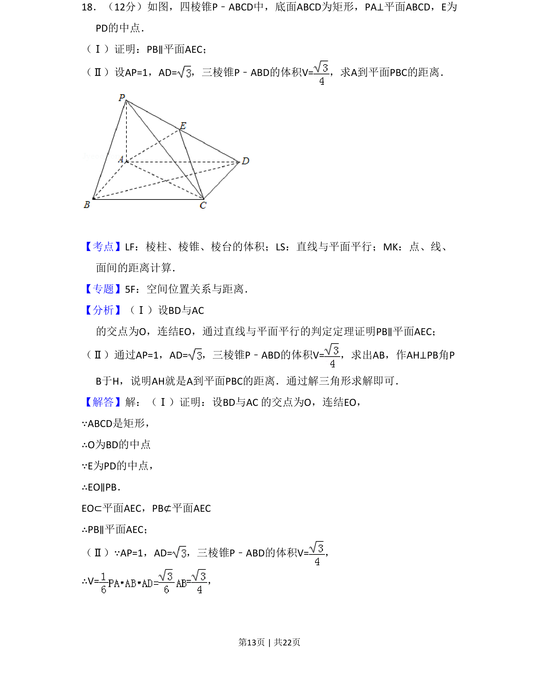
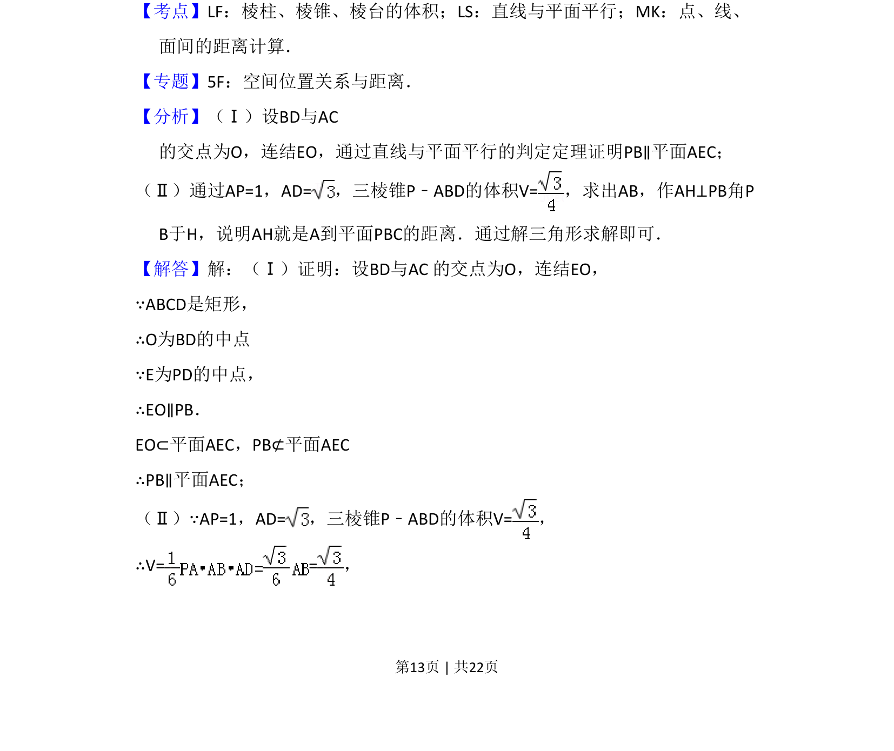
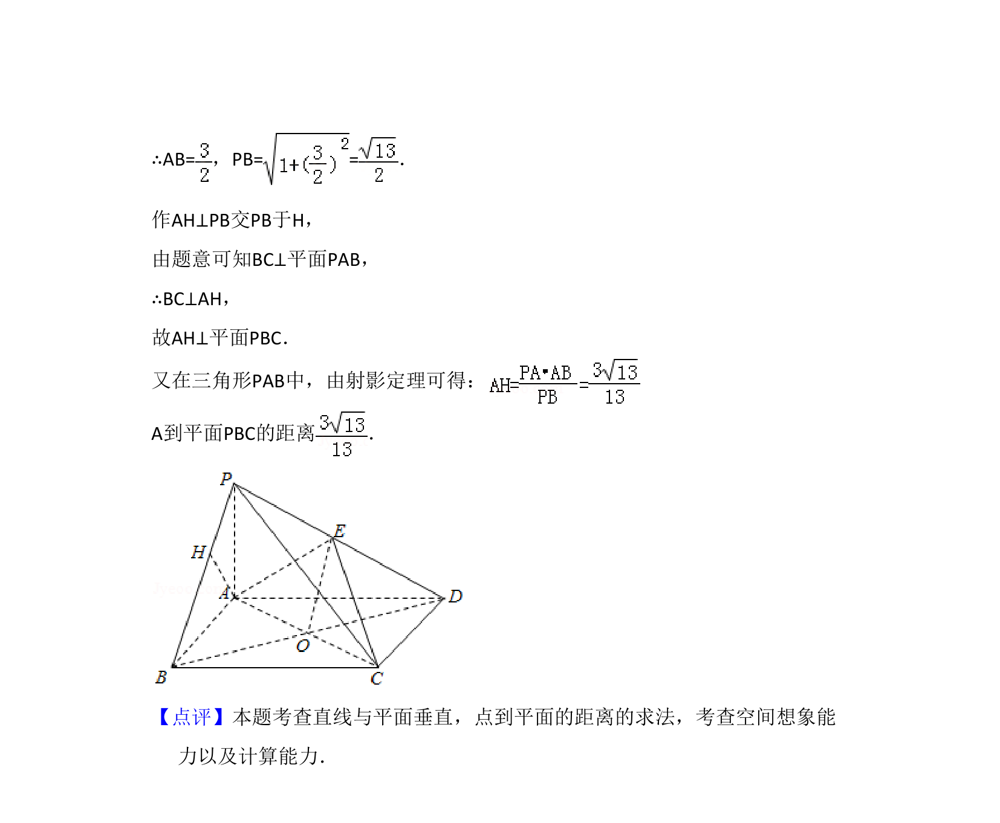

## 题面

## 摘要

证明线面平行及计算点到平面的距离，涉及四棱锥体积与距离求解。

## 关联考点

- [[936-棱锥体积|棱锥体积]]
- [[1012-直线与平面平行判定|直线与平面平行判定]]
- [[1196-点面距离计算|点面距离计算]]

## 答案与解析

> 📄 原 PDF 第 13 页：`素材/真题/吉林/2008-2024·（吉林）数学高考真题/2014年高考数学试卷（文）（新课标Ⅱ）（解析卷）.pdf`
