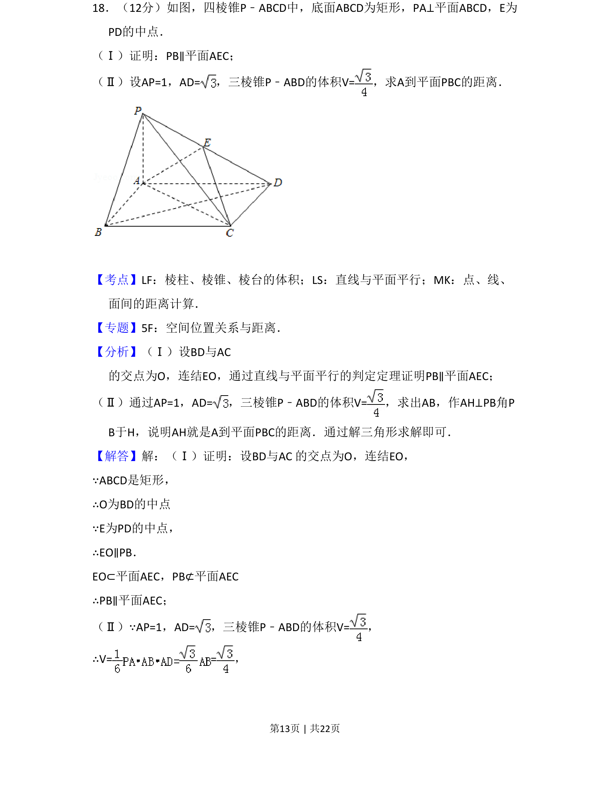
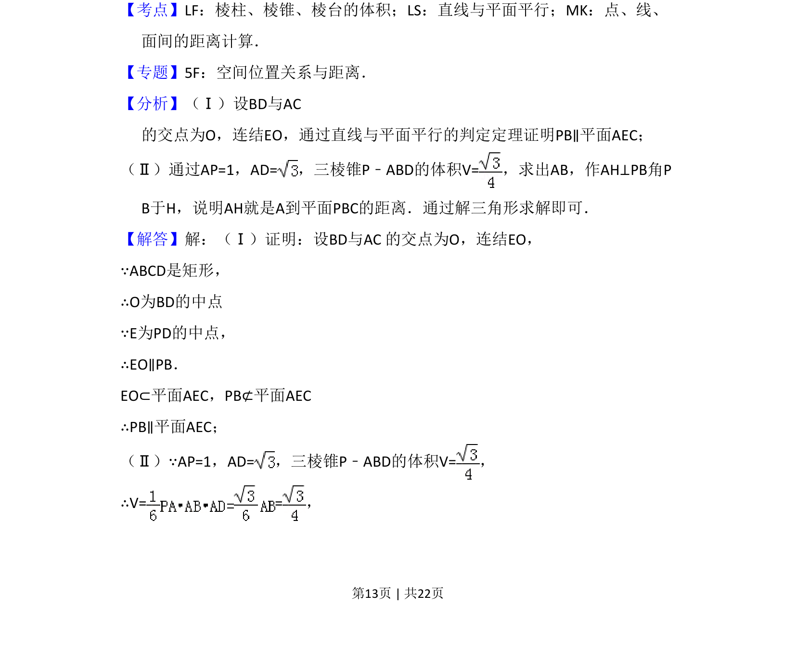
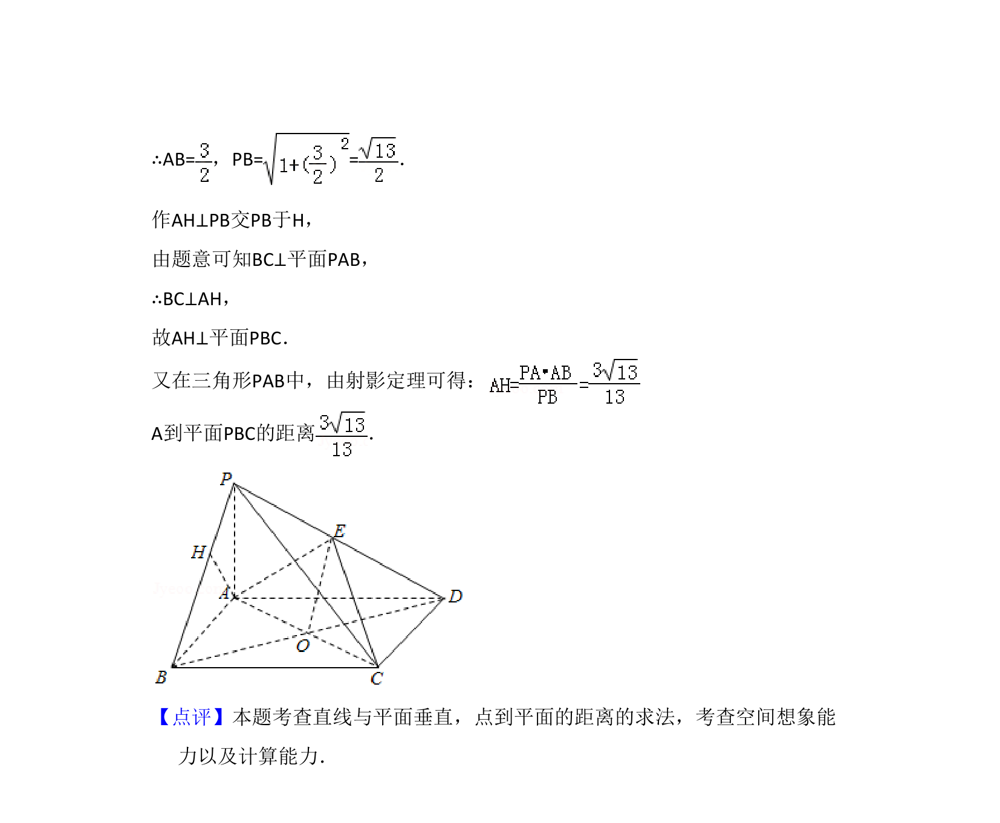

## 题面

## 摘要

证明线面平行及计算点到平面的距离，涉及四棱锥体积与距离求解。

## 关联考点

- [[936-棱锥体积|棱锥体积]]
- [[1012-直线与平面平行判定|直线与平面平行判定]]
- [[1196-点面距离计算|点面距离计算]]

## 答案与解析

> 📄 原 PDF 第 13 页：`素材/真题/吉林/2008-2024·（吉林）数学高考真题/2014年高考数学试卷（文）（新课标Ⅱ）（解析卷）.pdf`

<!-- 题干文本-start -->
## 题干文本
18．（12分）如图，四棱锥P﹣ABCD中，底面ABCD为矩形，PA⊥平面ABCD，E为
PD的中点．
（Ⅰ）证明：PB∥平面AEC；
（Ⅱ）设AP=1，AD=，三棱锥P﹣ABD的体积V=，求A到平面PBC的距离．
<!-- 题干文本-end -->

<!-- 解析文本-start -->
## 解析文本
【考点】LF：棱柱、棱锥、棱台的体积；LS：直线与平面平行；MK：点、线、
面间的距离计算．菁优网版权所有
【专题】5F：空间位置关系与距离．
【分析】（Ⅰ）设BD与AC 
的交点为O，连结EO，通过直线与平面平行的判定定理证明PB∥平面AEC；
（Ⅱ）通过AP=1，AD=，三棱锥P﹣ABD的体积V=，求出AB，作AH⊥PB角P
B于H，说明AH就是A到平面PBC的距离．通过解三角形求解即可．
【解答】解：（Ⅰ）证明：设BD与AC 的交点为O，连结EO，
∵ABCD是矩形，
∴O为BD的中点
∵E为PD的中点，
∴EO∥PB．
EO⊂平面AEC，PB⊄平面AEC
∴PB∥平面AEC；
（Ⅱ）∵AP=1，AD=，三棱锥P﹣ABD的体积V=，
∴V= =，
<!-- 解析文本-end -->
