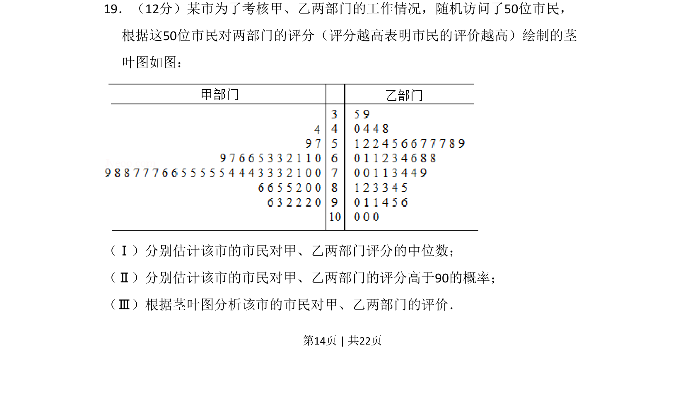
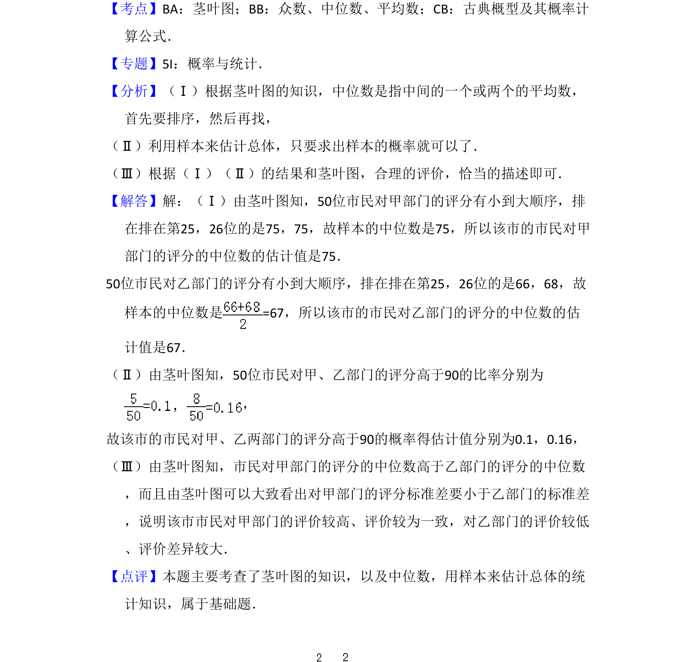

## 题面

## 摘要

该题通过茎叶图数据，考查中位数和概率的估计及数据评价分析能力。

## 关联考点

- [[360-茎叶图|茎叶图]]
- [[180-中位数|中位数]]
- [[概率估计]]
- [[数据分析]]

## 答案与解析

> 📄 原 PDF 第 14 页：`素材/真题/吉林/2008-2024·（吉林）数学高考真题/2014年高考数学试卷（文）（新课标Ⅱ）（解析卷）.pdf`
