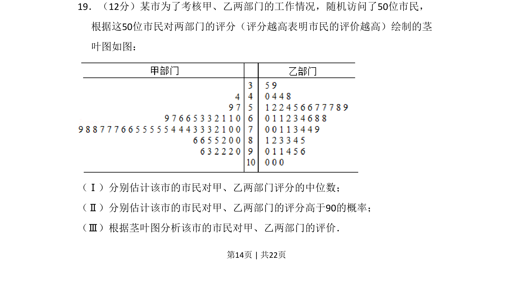
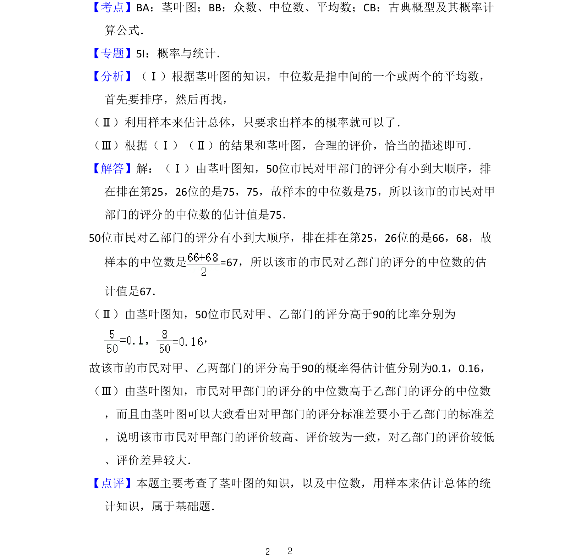

## 题面

## 摘要

该题通过茎叶图数据，考查中位数和概率的估计及数据评价分析能力。

## 关联考点

- [[360-茎叶图|茎叶图]]
- [[180-中位数|中位数]]
- [[1186-概率估计|概率估计]]
- [[899-数据分析|数据分析]]

## 答案与解析

> 📄 原 PDF 第 14 页：`素材/真题/吉林/2008-2024·（吉林）数学高考真题/2014年高考数学试卷（文）（新课标Ⅱ）（解析卷）.pdf`

<!-- 题干文本-start -->
## 题干文本
19．（12分）某市为了考核甲、乙两部门的工作情况，随机访问了50位市民，
根据这50位市民对两部门的评分（评分越高表明市民的评价越高）绘制的茎
叶图如图：
（Ⅰ）分别估计该市的市民对甲、乙两部门评分的中位数；
（Ⅱ）分别估计该市的市民对甲、乙两部门的评分高于90的概率；
（Ⅲ）根据茎叶图分析该市的市民对甲、乙两部门的评价．
<!-- 题干文本-end -->

<!-- 解析文本-start -->
## 解析文本

<!-- 解析文本-end -->
