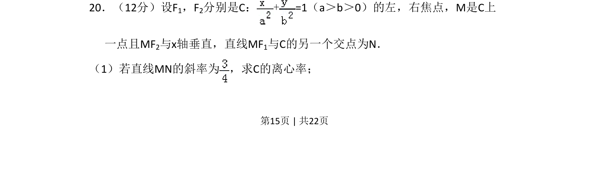
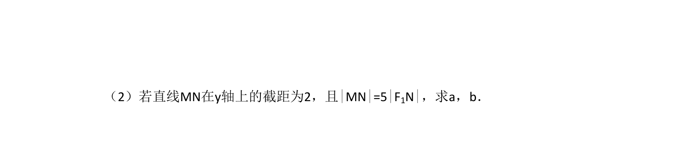
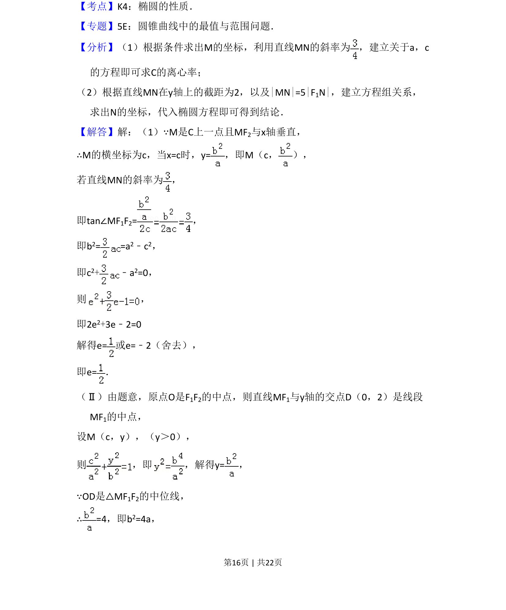
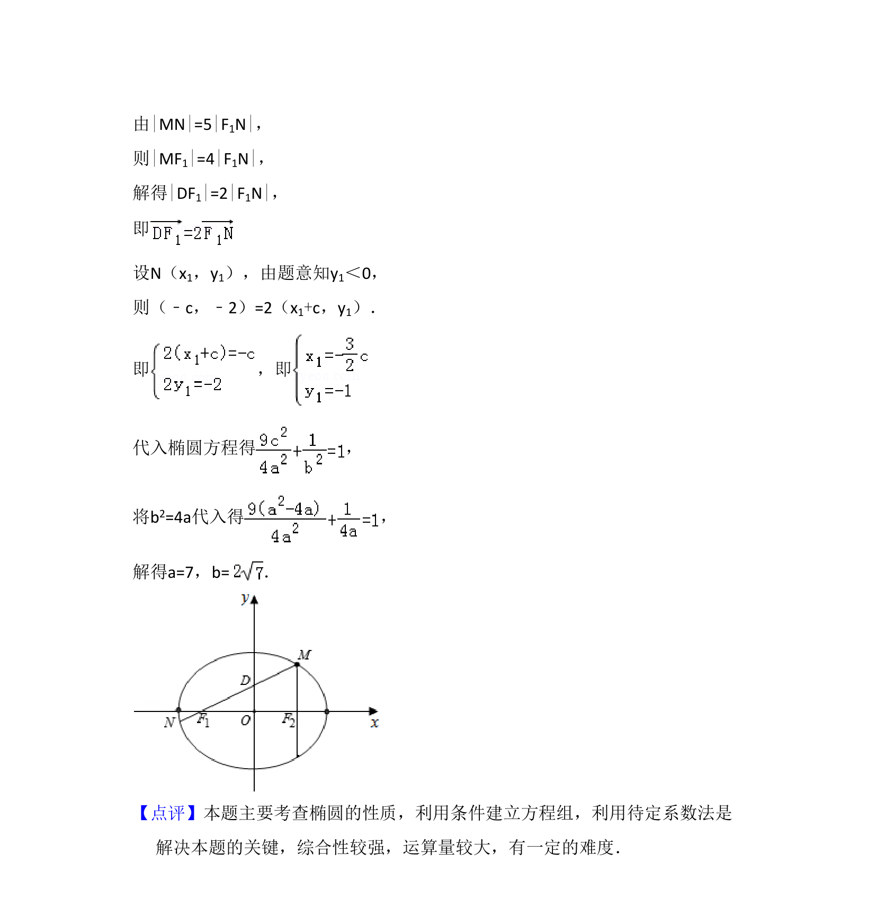

## 题面

## 摘要

已知椭圆上点M满足MF₂⊥x轴，结合直线MN的斜率求椭圆离心率。

## 关联考点

- [[941-椭圆标准方程|椭圆标准方程]]
- [[388-椭圆几何性质|椭圆几何性质]]
- [[391-椭圆离心率|离心率]]
- [[902-斜率公式|斜率公式]]

## 答案与解析

> 📄 原 PDF 第 15 页：`素材/真题/吉林/2008-2024·（吉林）数学高考真题/2014年高考数学试卷（文）（新课标Ⅱ）（解析卷）.pdf`
