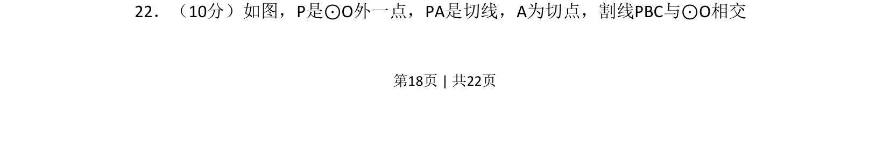
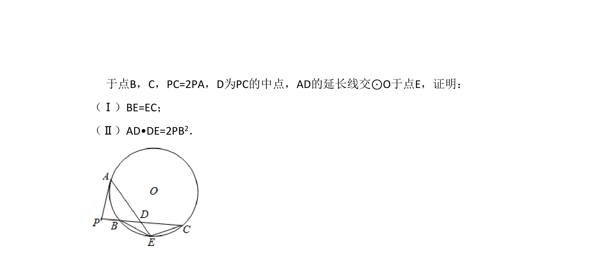
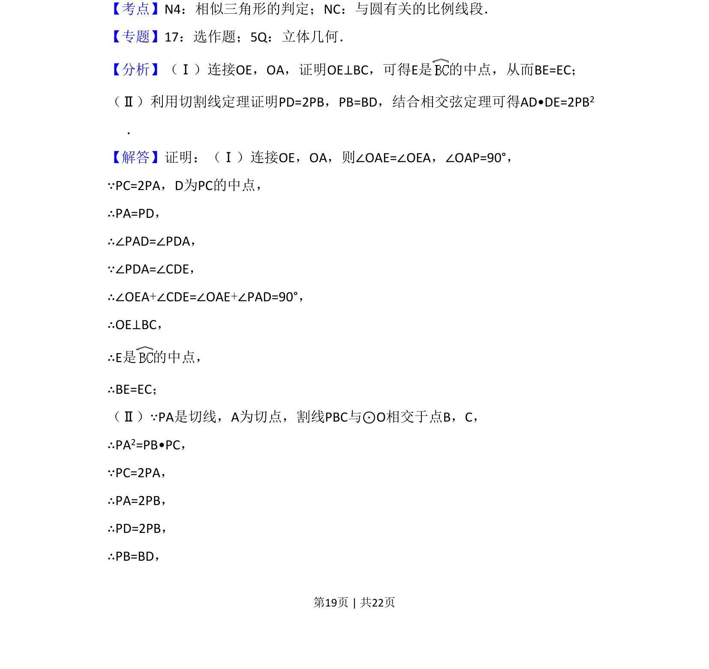
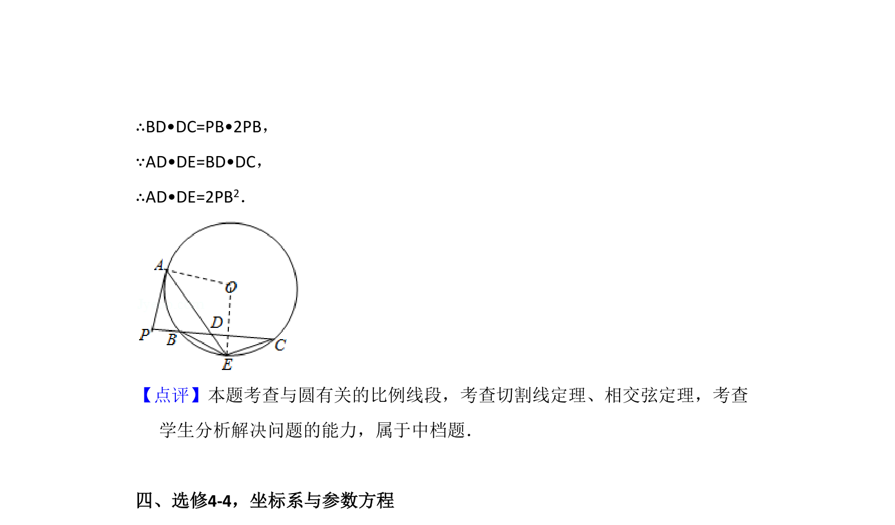

## 题面

## 摘要

根据切线及割线关系求线段长度或角度，考查切割线定理的应用。

## 关联考点

- [[700-切割线定理|切割线定理]]
- [[702-切线性质|切线性质]]
- [[1177-与圆有关的比例线段|圆幂定理]]

## 答案与解析

> 📄 原 PDF 第 18 页：`素材/真题/吉林/2008-2024·（吉林）数学高考真题/2014年高考数学试卷（文）（新课标Ⅱ）（解析卷）.pdf`
