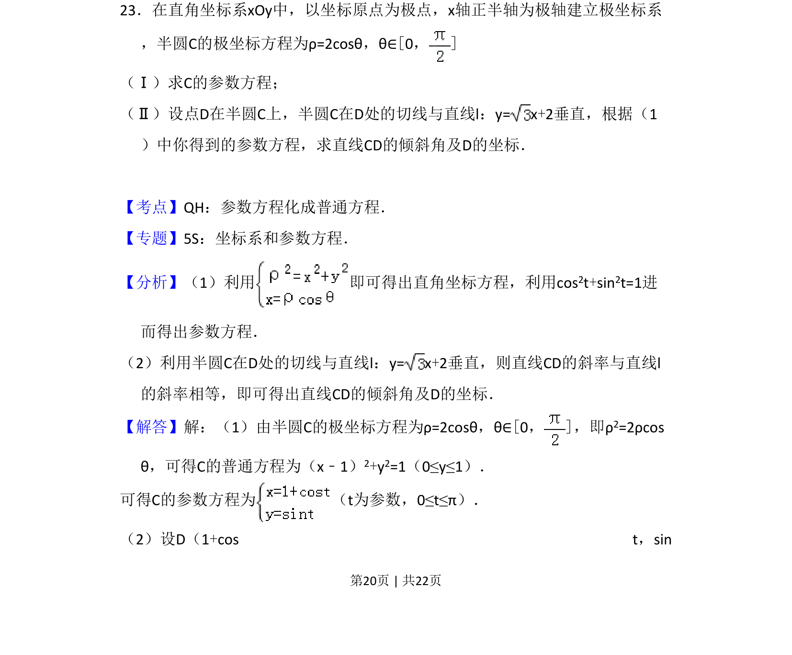
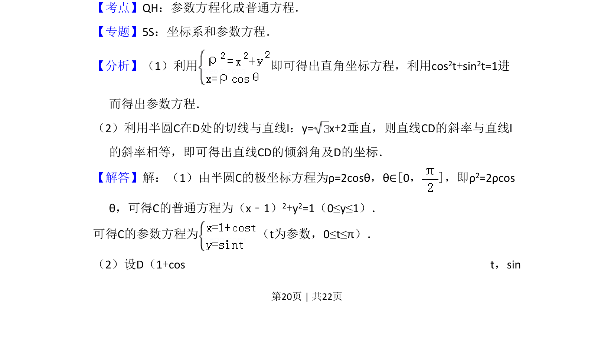
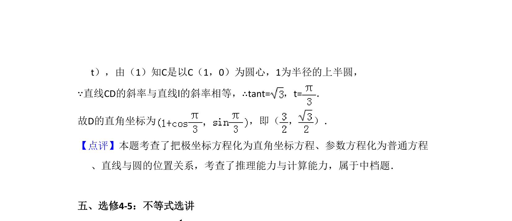

## 题面

## 摘要

半圆极坐标方程转参数方程，利用切线垂直关系求点的坐标和倾斜角。

## 关联考点

- [[722-参数方程化成普通方程|参数方程化成普通方程]]
- [[920-极坐标与直角坐标互化|极坐标与直角坐标互化]]
- [[1025-直线斜率与倾斜角|直线斜率与倾斜角]]

## 答案与解析

> 📄 原 PDF 第 20 页：`素材/真题/吉林/2008-2024·（吉林）数学高考真题/2014年高考数学试卷（文）（新课标Ⅱ）（解析卷）.pdf`

<!-- 题干文本-start -->
## 题干文本
23．在直角坐标系xOy中，以坐标原点为极点，x轴正半轴为极轴建立极坐标系
，半圆C的极坐标方程为ρ=2cosθ，θ∈[0，]
（Ⅰ）求C的参数方程；
（Ⅱ）设点D在半圆C上，半圆C在D处的切线与直线l：y= x+2垂直，根据（1
）中你得到的参数方程，求直线CD的倾斜角及D的坐标．
<!-- 题干文本-end -->

<!-- 解析文本-start -->
## 解析文本
【考点】QH：参数方程化成普通方程．菁优网版权所有
【专题】5S：坐标系和参数方程．
【分析】（1）利用 即可得出直角坐标方程，利用cos 2t+sin2t=1进
而得出参数方程．
（2）利用半圆C在D处的切线与直线l：y= x+2垂直，则直线CD的斜率与直线l
的斜率相等，即可得出直线CD的倾斜角及D的坐标．
【解答】解：（1）由半圆C的极坐标方程为ρ=2cosθ，θ∈[0，]，即ρ 2=2ρcos
θ，可得C的普通方程为（x﹣1）2+y2=1（0≤y≤1）．
可得C的参数方程为 （t为参数，0≤t≤π）．
（2）设D（1+cos t，sin
<!-- 解析文本-end -->
