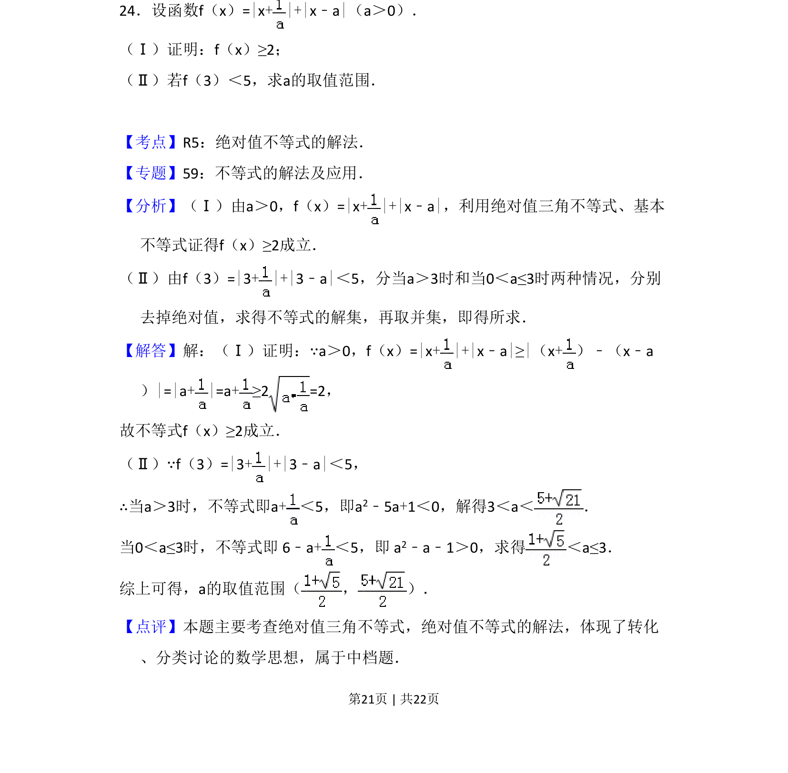
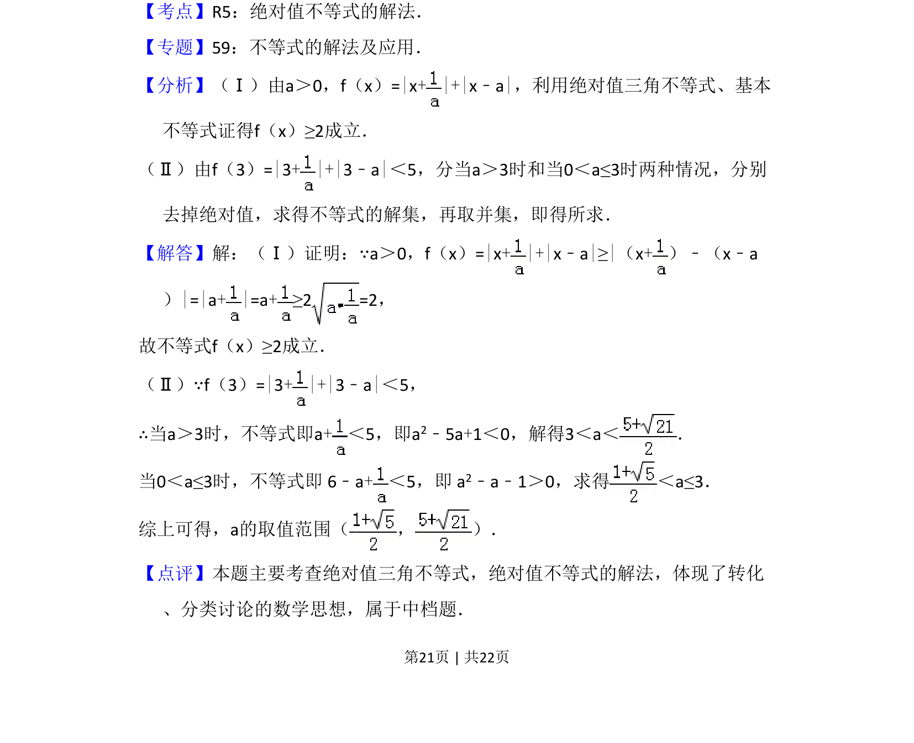
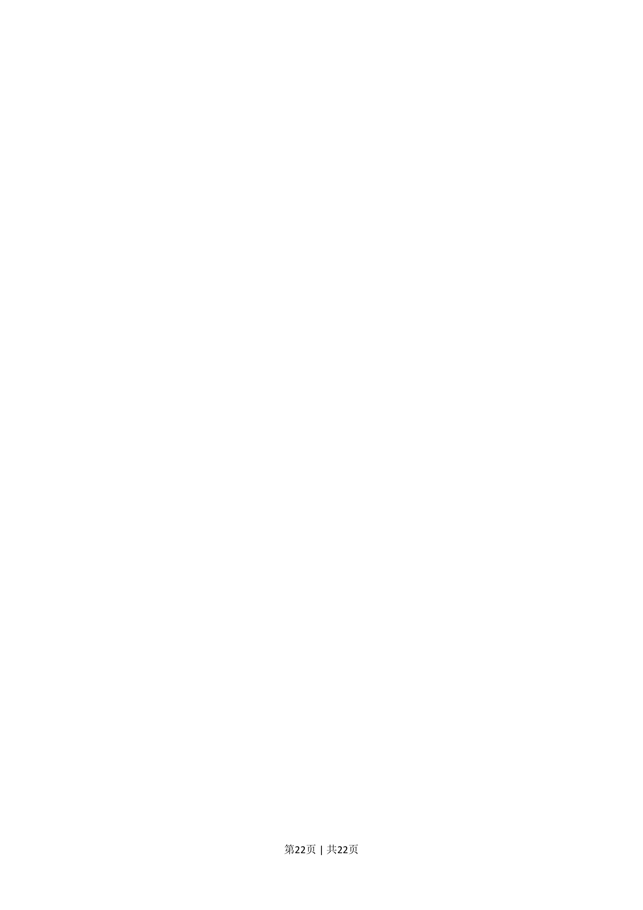

## 题面

## 摘要

本题考查含双绝对值的函数证明最小值及解含参绝对值不等式，涉及分类讨论。

## 关联考点

- [[1159-绝对值三角不等式|绝对值三角不等式]]
- [[295-基本不等式|基本不等式]]
- [[1094-绝对值不等式的解法|绝对值不等式的解法]]
- [[424-参数分类讨论|分类讨论]]

## 答案与解析

> 📄 原 PDF 第 21 页：`素材/真题/吉林/2008-2024·（吉林）数学高考真题/2014年高考数学试卷（文）（新课标Ⅱ）（解析卷）.pdf`
