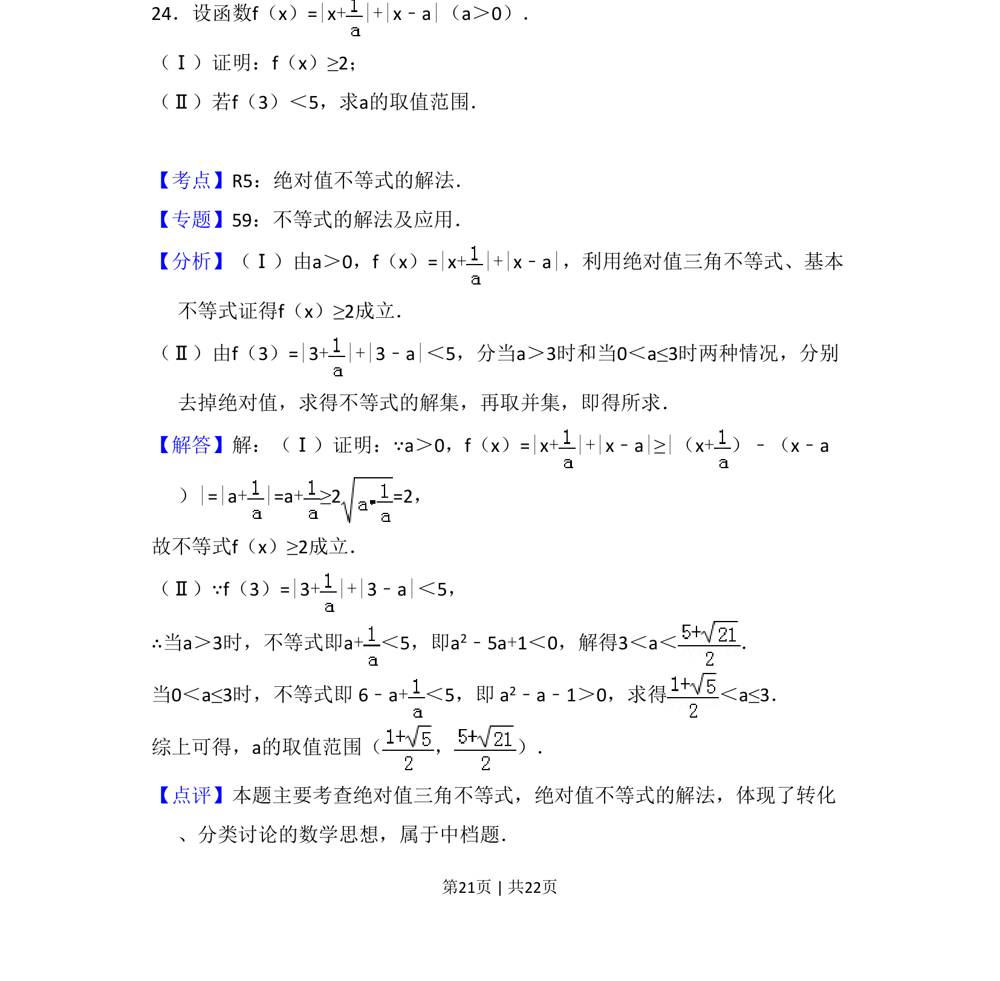
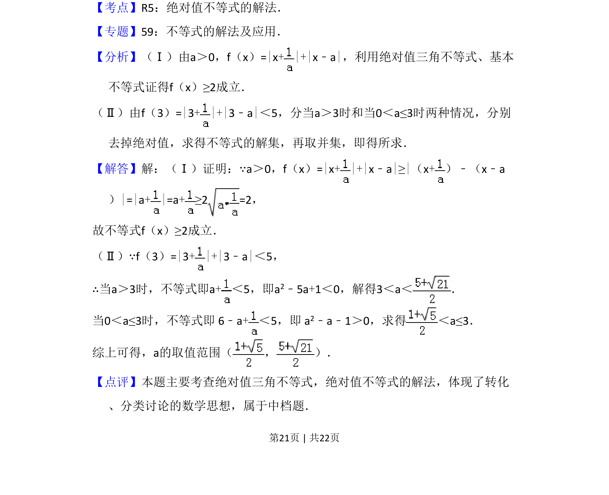

## 题面

## 摘要

本题考查含双绝对值的函数证明最小值及解含参绝对值不等式，涉及分类讨论。

## 关联考点

- [[1158-绝对值三角不等式|绝对值三角不等式]]
- [[295-基本不等式|基本不等式]]
- [[1093-绝对值不等式的解法|绝对值不等式的解法]]
- [[424-参数分类讨论|分类讨论]]

## 答案与解析

> 📄 原 PDF 第 21 页：`素材/真题/吉林/2008-2024·（吉林）数学高考真题/2014年高考数学试卷（文）（新课标Ⅱ）（解析卷）.pdf`

<!-- 题干文本-start -->
## 题干文本
24．设函数f（x）=|x+ |+|x﹣a|（a＞0）．
（Ⅰ）证明：f（x）≥2；
（Ⅱ）若f（3）＜5，求a的取值范围．
<!-- 题干文本-end -->

<!-- 解析文本-start -->
## 解析文本
【考点】R5：绝对值不等式的解法．菁优网版权所有
【专题】59：不等式的解法及应用．
【分析】（Ⅰ）由a＞0，f（x）=|x+ |+|x﹣a|，利用绝对值三角不等式、基本
不等式证得f（x）≥2成立．
（Ⅱ）由f（3）=|3+ |+|3﹣a|＜5，分当a＞3时和当0＜a≤3时两种情况，分别
去掉绝对值，求得不等式的解集，再取并集，即得所求．
【解答】解：（Ⅰ）证明：∵a＞0，f（x）=|x+ |+|x﹣a|≥|（x+）﹣（x﹣a
）|=|a+ |=a+≥2 =2，
故不等式f（x）≥2成立．
（Ⅱ）∵f（3）=|3+ |+|3﹣a|＜5，
∴当a＞3时，不等式即a+＜5，即a 2﹣5a+1＜0，解得3＜a＜ ．
当0＜a≤3时，不等式即 6﹣a+＜5，即 a 2﹣a﹣1＞0，求得 ＜a≤3．
综上可得，a的取值范围（ ， ）．
【点评】本题主要考查绝对值三角不等式，绝对值不等式的解法，体现了转化
、分类讨论的数学思想，属于中档题．
<!-- 解析文本-end -->
