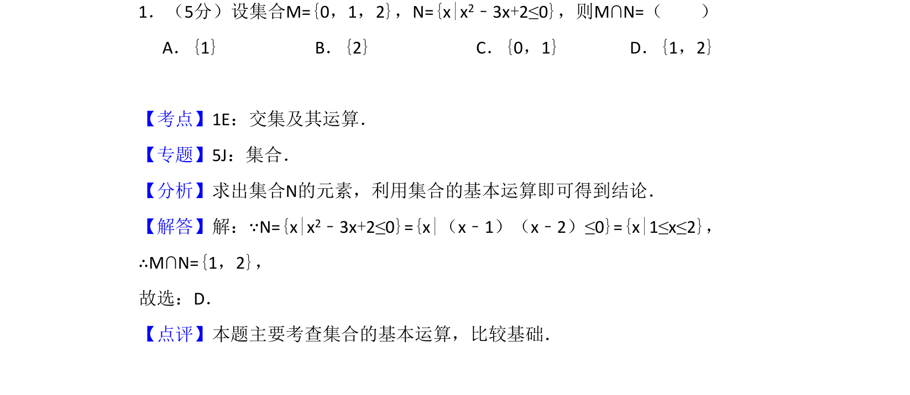
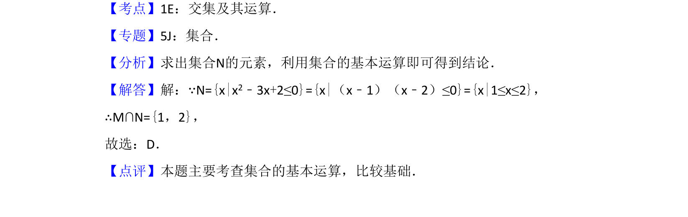

## 题面

## 摘要

本题通过解一元二次不等式求集合N，再计算与集合M的交集。

## 关联考点

- [[314-集合的运算|集合的运算]]
- [[267-一元二次不等式|一元二次不等式]]

## 答案与解析

> 📄 原 PDF 第 1 页：`素材/真题/吉林/2008-2024·（吉林）数学高考真题/2014年高考数学试卷（理）（新课标Ⅱ）（解析卷）.pdf`

<!-- 题干文本-start -->
## 题干文本
1．（5分）设集合M={0，1，2}，N={x|x2﹣3x+2≤0}，则M∩N=（　　）
A．{1}B．{2}C．{0，1}D．{1，2}
<!-- 题干文本-end -->

<!-- 解析文本-start -->
## 解析文本
【考点】1E：交集及其运算．菁优网版权所有
【专题】5J：集合．
【分析】求出集合N的元素，利用集合的基本运算即可得到结论．
【解答】解：∵N={x|x2﹣3x+2≤0}={x|（x﹣1）（x﹣2）≤0}={x|1≤x≤2}，
∴M∩N={1，2}，
故选：D．
【点评】本题主要考查集合的基本运算，比较基础．
<!-- 解析文本-end -->
