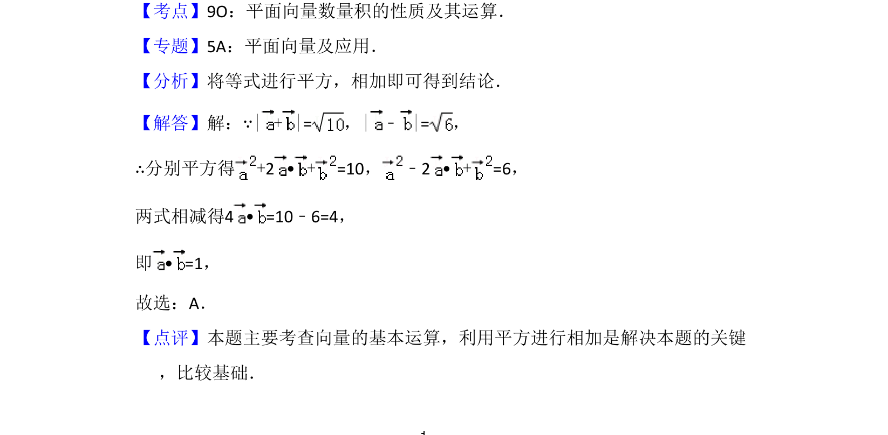

## 题面

## 摘要

考查平面向量模长与数量积关系，通过平方运算求解向量点积。

## 关联考点

- [[854-平面向量数量积|平面向量数量积]]
- [[752-向量模长|向量模长]]
- [[844-平方消元|平方消元]]

## 答案与解析

> 📄 原 PDF 第 2 页：`素材/真题/吉林/2008-2024·（吉林）数学高考真题/2014年高考数学试卷（理）（新课标Ⅱ）（解析卷）.pdf`

<!-- 题干文本-start -->
## 题干文本
3．（5分）设向量 ， 满足| + |=，|﹣|=，则• =（　　）
A．1 B．2 C．3 D．5
<!-- 题干文本-end -->

<!-- 解析文本-start -->
## 解析文本
【考点】9O：平面向量数量积的性质及其运算．菁优网版权所有
【专题】5A：平面向量及应用．
【分析】将等式进行平方，相加即可得到结论．
【解答】解：∵| + |=，|﹣|=，
∴分别平方得+2 •+=10， ﹣2 •+=6，
两式相减得4 • =10﹣6=4，
即• =1，
故选：A．
【点评】本题主要考查向量的基本运算，利用平方进行相加是解决本题的关键
，比较基础．
<!-- 解析文本-end -->
