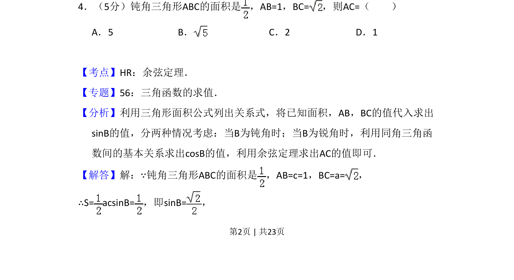
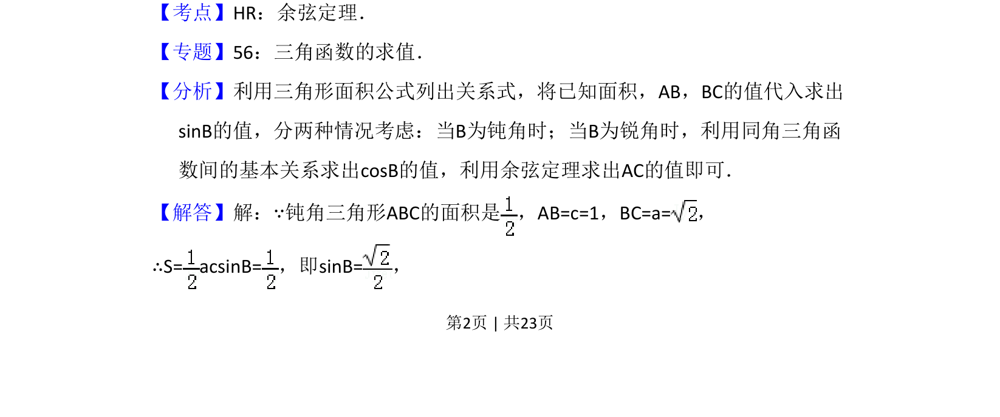
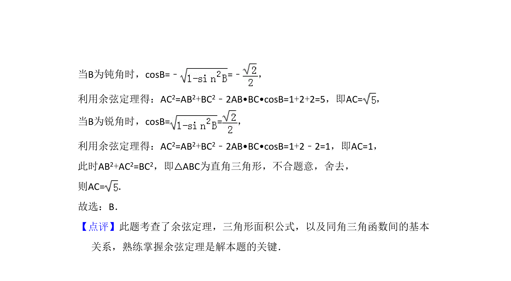

## 题面

## 摘要

已知钝角三角形两边及面积，利用面积公式求夹角正弦，分类讨论并利用余弦定理求第三边。

## 关联考点

- [[126-定理|余弦定理]]
- [[619-三角形面积公式|三角形面积公式]]
- [[589-解三角形|解三角形]]
- [[424-参数分类讨论|分类讨论]]

## 答案与解析

> 📄 原 PDF 第 2 页：`素材/真题/吉林/2008-2024·（吉林）数学高考真题/2014年高考数学试卷（理）（新课标Ⅱ）（解析卷）.pdf`
