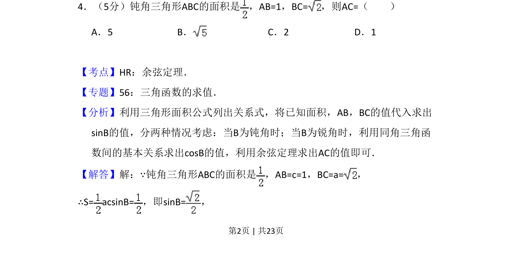
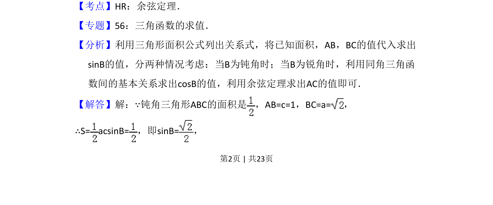
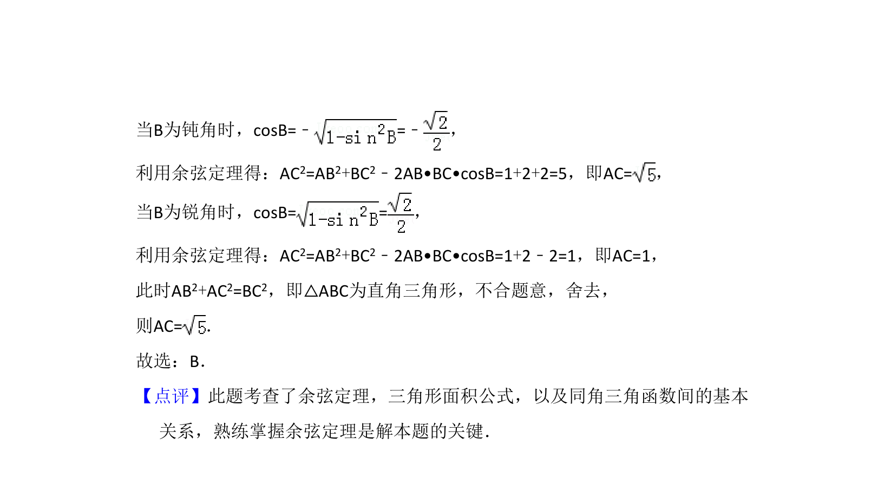

## 题面

## 摘要

已知钝角三角形两边及面积，利用面积公式求夹角正弦，分类讨论并利用余弦定理求第三边。

## 关联考点

- [[126-定理|余弦定理]]
- [[619-三角形面积公式|三角形面积公式]]
- [[589-解三角形|解三角形]]
- [[424-参数分类讨论|分类讨论]]

## 答案与解析

> 📄 原 PDF 第 2 页：`素材/真题/吉林/2008-2024·（吉林）数学高考真题/2014年高考数学试卷（理）（新课标Ⅱ）（解析卷）.pdf`

<!-- 题干文本-start -->
## 题干文本
4．（5分）钝角三角形ABC的面积是 ，AB=1，BC=，则AC=（　　）
A．5 B．C．2 D．1
<!-- 题干文本-end -->

<!-- 解析文本-start -->
## 解析文本
【考点】HR：余弦定理．菁优网版权所有
【专题】56：三角函数的求值．
【分析】利用三角形面积公式列出关系式，将已知面积，AB，BC的值代入求出
sinB的值，分两种情况考虑：当B为钝角时；当B为锐角时，利用同角三角函
数间的基本关系求出cosB的值，利用余弦定理求出AC的值即可．
【解答】解：∵钝角三角形ABC的面积是 ，AB=c=1，BC=a=，
∴S= acsinB=，即sinB=，
<!-- 解析文本-end -->
