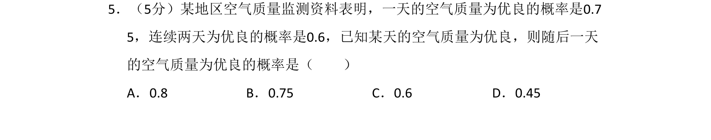
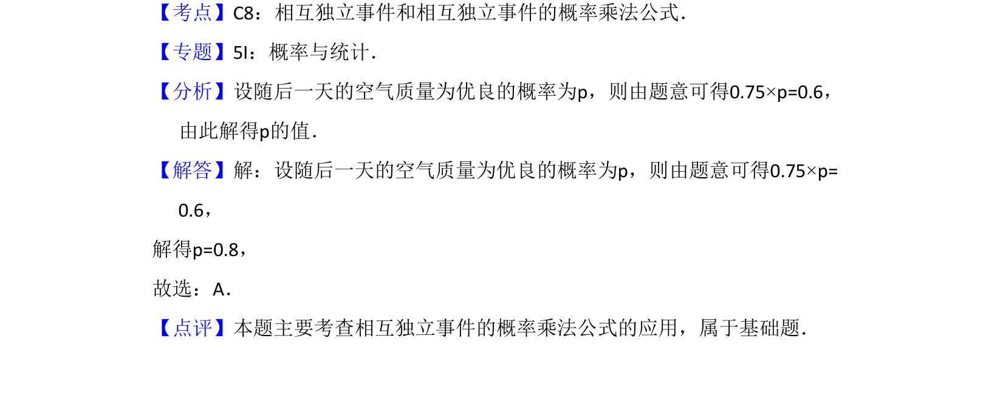

## 题面

## 摘要

本题利用相互独立事件的概率乘法公式求解条件概率。

## 关联考点

- [[468-事件相互独立性-高中|相互独立事件]]
- [[946-概率乘法公式|概率乘法公式]]
- [[340-条件概率初步|条件概率]]

## 答案与解析

> 📄 原 PDF 第 3 页：`素材/真题/吉林/2008-2024·（吉林）数学高考真题/2014年高考数学试卷（理）（新课标Ⅱ）（解析卷）.pdf`
