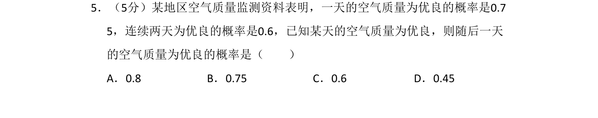
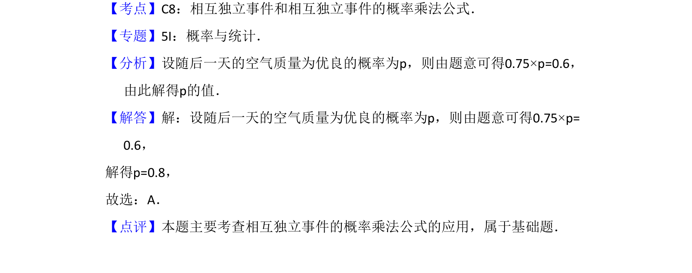

## 题面

## 摘要

本题利用相互独立事件的概率乘法公式求解条件概率。

## 关联考点

- [[468-事件相互独立性-高中|相互独立事件]]
- [[946-概率乘法公式|概率乘法公式]]
- [[340-条件概率初步|条件概率]]

## 答案与解析

> 📄 原 PDF 第 3 页：`素材/真题/吉林/2008-2024·（吉林）数学高考真题/2014年高考数学试卷（理）（新课标Ⅱ）（解析卷）.pdf`

<!-- 题干文本-start -->
## 题干文本
5．（5分）某地区空气质量监测资料表明，一天的空气质量为优良的概率是0.7
5，连续两天为优良的概率是0.6，已知某天的空气质量为优良，则随后一天
的空气质量为优良的概率是（　　）
A．0.8 B．0.75 C．0.6 D．0.45
<!-- 题干文本-end -->

<!-- 解析文本-start -->
## 解析文本
【考点】C8：相互独立事件和相互独立事件的概率乘法公式．菁优网版权所有
【专题】5I：概率与统计．
【分析】设随后一天的空气质量为优良的概率为p，则由题意可得0.75×p=0.6，
由此解得p的值．
【解答】解：设随后一天的空气质量为优良的概率为p，则由题意可得0.75×p=
0.6，
解得p=0.8，
故选：A．
【点评】本题主要考查相互独立事件的概率乘法公式的应用，属于基础题．
<!-- 解析文本-end -->
